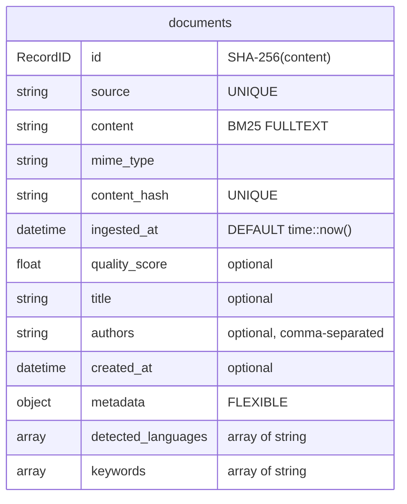
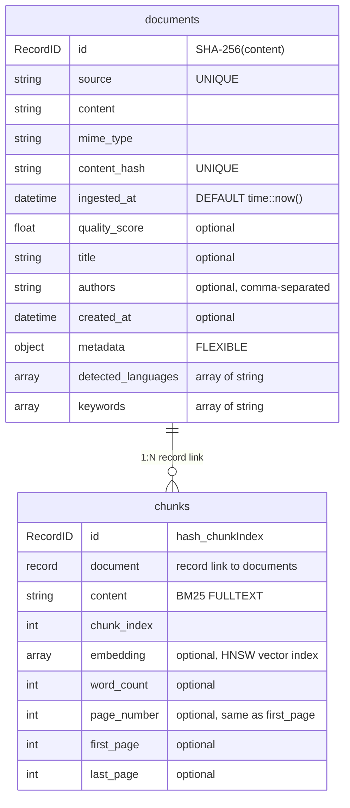

# kreuzberg-surrealdb

<div align="center" style="display: flex; flex-wrap: wrap; gap: 8px; justify-content: center; margin: 20px 0;">
  <a href="https://pypi.org/project/kreuzberg-surrealdb/"></a>
  <a href="https://pypi.org/project/kreuzberg-surrealdb/"></a>
  <a href="https://github.com/kreuzberg-dev/kreuzberg-surrealdb/blob/main/LICENSE"></a>
  <a href="https://docs.kreuzberg.dev"></a>
</div>


<div align="center" style="margin-top: 20px;">
  <a href="https://discord.gg/xt9WY3GnKR">
    
  </a>
</div>

Kreuzberg-to-SurrealDB connector for document ingestion pipelines.

Bridges [Kreuzberg](https://github.com/kreuzberg-dev/kreuzberg) extraction into [SurrealDB](https://surrealdb.com/) — handles schema generation, content deduplication, chunk storage, and index configuration.

## Features

- **Automated schema management** — generates SurrealDB tables, BM25/HNSW indexes, and analyzers via `setup_schema()`
- **Content deduplication** — SHA-256 content hashing with deterministic record IDs prevents duplicates across ingestion runs
- **Two-tier architecture** — `DocumentConnector` for full documents, `DocumentPipeline` for chunked + embedded documents
- **Flexible embedding control** — use preset models, custom ONNX models via kreuzberg's `EmbeddingModelType`, or disable embeddings entirely with `embed=False`
- **Record-linked chunks** — chunks reference their parent document via SurrealDB record links, enabling join-like traversal in SurQL
- **Configurable indexing** — tune BM25 (k1, b, analyzer language) and HNSW (distance metric, EFC, M) parameters per schema
- **Batch ingestion** — ingest single files, multiple files, directories (with glob), or raw bytes, with configurable `insert_batch_size`

## Installation

```bash
pip install kreuzberg-surrealdb
```

Requires Python 3.10+.

## Quickstart

### Start a SurrealDB server

```bash
docker run --rm -p 8000:8000 surrealdb/surrealdb:latest start --allow-all --user root --pass root
```

### Document-level search with `DocumentConnector`

Extract full documents and search with BM25. No chunking, no embeddings — fast and simple.

```python
import asyncio
from surrealdb import AsyncSurreal
from kreuzberg_surrealdb import DocumentConnector

async def main():
    db = AsyncSurreal("ws://localhost:8000")
    await db.connect()
    await db.signin({"username": "root", "password": "root"})
    await db.use("default", "default")

    connector = DocumentConnector(db=db)
    await connector.setup_schema()
    await connector.ingest_file("report.pdf")

    # BM25 full-text search via the SurrealDB client
    t = connector.table
    results = await connector.client.query(
        f"SELECT *, search::score(1) AS score FROM {t} "
        f"WHERE content @1@ $query ORDER BY score DESC LIMIT $limit",
        {"query": "quarterly revenue", "limit": 5},
    )
    for r in results:
        print(r["source"], r["score"])

    await db.close()

asyncio.run(main())
```

### Hybrid search with `DocumentPipeline`

Chunk documents, generate embeddings, and search with vector + BM25 fused via Reciprocal Rank Fusion.

```python
import asyncio
from surrealdb import AsyncSurreal
from kreuzberg_surrealdb import DocumentPipeline

async def main():
    async with AsyncSurreal("ws://localhost:8000") as db:
        await db.signin({"username": "root", "password": "root"})
        await db.use("myapp", "knowledge_base")

        pipeline = DocumentPipeline(db=db, embed=True, embedding_model="balanced")
        await pipeline.setup_schema()
        await pipeline.ingest_directory("./papers", glob="**/*.pdf")

        ct = pipeline.chunk_table

        # Hybrid search (vector + BM25 with RRF)
        embedding = await pipeline.embed_query("attention mechanisms in transformers")
        results = await pipeline.client.query(
            f"SELECT * FROM search::rrf(["
            f"(SELECT id, content FROM {ct} WHERE embedding <|10,COSINE|> $embedding),"
            f"(SELECT id, content, search::score(1) AS score FROM {ct} "
            f"WHERE content @1@ $query ORDER BY score DESC LIMIT 10)"
            f"], 10, 60);",
            {"embedding": embedding, "query": "attention mechanisms in transformers"},
        )

        # Pure vector search
        embedding = await pipeline.embed_query("how neural networks learn")
        results = await pipeline.client.query(
            f"SELECT *, vector::distance::knn() AS distance FROM {ct} "
            f"WHERE embedding <|10,COSINE|> $embedding ORDER BY distance",
            {"embedding": embedding},
        )

        # BM25 search over chunks
        results = await pipeline.client.query(
            f"SELECT *, search::score(1) AS score FROM {ct} "
            f"WHERE content @1@ $query ORDER BY score DESC LIMIT 10",
            {"query": "error code XYZ-123"},
        )

asyncio.run(main())
```

## Choosing a Class

| | `DocumentConnector` | `DocumentPipeline` | `DocumentPipeline(embed=False)` |
|---|---|---|---|
| Stores | Full documents | Documents + chunks | Documents + chunks |
| Embeddings | No | Yes (configurable) | No |
| Indexes | BM25 on documents | BM25 + HNSW on chunks | BM25 on chunks |
| Best for | Keyword search on whole docs | Semantic/hybrid search on chunks | Keyword search on chunks |

## API Reference

### `DocumentConnector`

```python
DocumentConnector(*, db: AsyncSurrealQueryable, table: str = "documents", insert_batch_size: int = 100,
                  config: ExtractionConfig | None = None)
```

| Method / Property | Description |
|---|---|
| `client` | The underlying SurrealDB connection |
| `table` | The documents table name |
| `analyzer_name` | The BM25 analyzer name (for use in custom SurQL) |
| `setup_schema(*, analyzer_language="english", bm25_k1=1.2, bm25_b=0.75)` | Create documents table and BM25 index |
| `ingest_file(path)` | Extract and store a single file |
| `ingest_files(paths)` | Extract and store multiple files |
| `ingest_directory(directory, *, glob="**/*")` | Extract and store all matching files |
| `ingest_bytes(*, data, mime_type, source)` | Extract and store from raw bytes |

### `DocumentPipeline`

```python
DocumentPipeline(*, db: AsyncSurrealQueryable, table: str = "documents", insert_batch_size: int = 100,
                 chunk_table: str = "chunks", config: ExtractionConfig | None = None,
                 embed: bool = True, embedding_model: str | EmbeddingModelType = "balanced",
                 embedding_dimensions: int | None = None)
```

| Method / Property | Description |
|---|---|
| `client` | The underlying SurrealDB connection |
| `table` | The documents table name |
| `chunk_table` | The chunks table name |
| `analyzer_name` | The BM25 analyzer name (for use in custom SurQL) |
| `embedding_dimensions` | The vector embedding dimensions |
| `setup_schema(*, analyzer_language="english", bm25_k1=1.2, bm25_b=0.75, distance_metric="COSINE", hnsw_efc=150, hnsw_m=12)` | Create documents + chunks tables with BM25 and HNSW indexes (HNSW skipped when `embed=False`) |
| `ingest_file(path)` | Extract and store a single file |
| `ingest_files(paths)` | Extract and store multiple files |
| `ingest_directory(directory, *, glob="**/*")` | Extract and store all matching files |
| `ingest_bytes(*, data, mime_type, source)` | Extract and store from raw bytes |
| `embed_query(query)` | Embed a query string, returns `list[float]` (only when `embed=True`) |

### Embedding Models

The `embedding_model` parameter accepts a preset name (string) or an `EmbeddingModelType` directly.

**Preset string** — dimensions are auto-inferred:

```python
# Uses bge-base-en-v1.5, dimensions automatically set to 768
pipeline = DocumentPipeline(db=db, embedding_model="balanced")
```

| Preset | Model | Dimensions | Notes |
|---|---|---|---|
| `"fast"` | all-MiniLM-L6-v2 | 384 | Fastest, lowest memory |
| `"balanced"` | bge-base-en-v1.5 | 768 | Default, good quality |
| `"quality"` | bge-large-en-v1.5 | 1024 | Best English quality |
| `"multilingual"` | multilingual-e5-base | 768 | Non-English documents |

**`EmbeddingModelType`** — you must provide `embedding_dimensions` (the type is opaque):

```python
from kreuzberg import EmbeddingModelType

# Use any supported fastembed model
model = EmbeddingModelType.fastembed("NomicEmbedTextV15", 768)
pipeline = DocumentPipeline(db=db, embedding_model=model, embedding_dimensions=768)

# Use a custom ONNX model
model = EmbeddingModelType.custom("my-model", 512)
pipeline = DocumentPipeline(db=db, embedding_model=model, embedding_dimensions=512)
```

### Chunking Configuration

`DocumentPipeline` automatically chunks documents before indexing. Customize chunk size and overlap via kreuzberg's `ChunkingConfig`:

```python
from kreuzberg import ExtractionConfig, ChunkingConfig

config = ExtractionConfig(
    chunking=ChunkingConfig(
        max_chars=512,      # characters per chunk (default: 1000)
        max_overlap=100,    # overlap between chunks (default: 200)
    ),
)

pipeline = DocumentPipeline(db=db, config=config)
await pipeline.setup_schema()
await pipeline.ingest_directory("./papers")
```

The pipeline preserves your chunking parameters and injects the embedding configuration automatically — no need to configure embedding inside `ChunkingConfig` yourself.

`DocumentConnector` does not chunk; it stores full document content.

### Extraction Configuration

The `config` parameter on both classes accepts kreuzberg's `ExtractionConfig`, giving access to the full extraction pipeline — OCR for scanned documents, output format control, quality processing, and more:

```python
from kreuzberg import ExtractionConfig

config = ExtractionConfig(
    force_ocr=True,                  # OCR even for searchable PDFs
    enable_quality_processing=True,  # text quality post-processing
)

pipeline = DocumentPipeline(db=db, config=config)
await pipeline.setup_schema()
await pipeline.ingest_file("scanned_report.pdf")
```

See [kreuzberg's documentation](https://github.com/kreuzberg-dev/kreuzberg) for the full `ExtractionConfig` API.

## Ingestion Methods

All four methods are available on both classes:

```python
# Single file
await connector.ingest_file("report.pdf")

# Multiple files
await connector.ingest_files(["doc1.pdf", "doc2.docx", "notes.txt"])

# Directory with glob
await connector.ingest_directory("./documents", glob="**/*.pdf")

# Raw bytes (e.g., from an API response or file upload)
await connector.ingest_bytes(data=pdf_bytes, mime_type="application/pdf", source="upload://invoice.pdf")
```

## Deduplication

Documents are deduplicated by content. The SHA-256 hash of extracted text serves as the record ID. Re-ingesting the same content — even from different file paths — is a safe no-op.

```python
await connector.ingest_file("report.pdf")       # inserted
await connector.ingest_file("report.pdf")       # skipped (same content)
await connector.ingest_file("report_copy.pdf")  # skipped if content matches
```

## Quality Filtering

Each document record stores a `quality_score` (0.0–1.0) from extraction. Use it to filter low-quality extractions in SurQL queries:

```python
ct = pipeline.chunk_table
results = await pipeline.client.query(
    f"SELECT *, search::score(1) AS score FROM {ct} "
    f"WHERE document.quality_score >= $threshold AND content @1@ $query "
    f"ORDER BY score DESC LIMIT $limit",
    {"query": "budget projections", "threshold": 0.7, "limit": 10},
)
```

## Connection Lifecycle

You own the SurrealDB connection. Create it with the SDK, configure it (authenticate, select namespace/database), then pass it to kreuzberg-surrealdb:

```python
from surrealdb import AsyncSurreal

# Context manager (recommended)
async with AsyncSurreal("ws://localhost:8000") as db:
    await db.signin({"username": "root", "password": "root"})
    await db.use("default", "default")

    connector = DocumentConnector(db=db)
    await connector.setup_schema()
    ...

# Manual
db = AsyncSurreal("ws://localhost:8000")
await db.connect()
await db.signin({"username": "root", "password": "root"})
await db.use("default", "default")
try:
    connector = DocumentConnector(db=db)
    await connector.setup_schema()
    ...
finally:
    await db.close()
```

## Database Schema

`setup_schema()` generates schemafull tables with indexes. Table names are configurable via constructor parameters; values below are defaults.

### `DocumentConnector`



BM25 index on `documents.content` with configurable k1/b parameters. Analyzer uses class tokenizer with Snowball stemmer.

### `DocumentPipeline`



BM25 index on `chunks.content` (not documents). HNSW vector index on `chunks.embedding` only when `embed=True`, with configurable dimension, distance metric, EFC, and M parameters.

The `document` field is a SurrealDB record link — use it in SurQL to traverse to the parent or filter by document-level fields:

```surql
-- Get chunk with its document's source and quality score
SELECT *, document.source, document.quality_score FROM chunks WHERE content @1@ "budget" LIMIT 5;

-- Get sibling chunks from the same document
SELECT * FROM chunks WHERE document = $chunk.document ORDER BY chunk_index;
```

## Development

```bash
# Install dev dependencies
uv sync

# Run unit tests
uv run pytest --ignore=tests/test_integration.py

# Run integration tests (requires a SurrealDB v3 server)
docker run --rm -d -p 8000:8000 surrealdb/surrealdb:latest start --user root --pass root
SURREALDB_URL=ws://localhost:8000 uv run pytest tests/test_integration.py -v -m integration

# Lint and type check
uv run ruff check .
uv run mypy src/
```

## License

[MIT](LICENSE)
