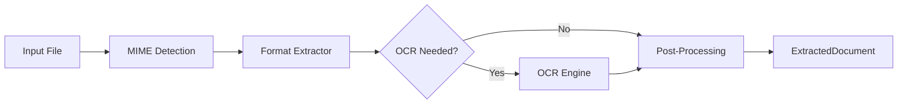
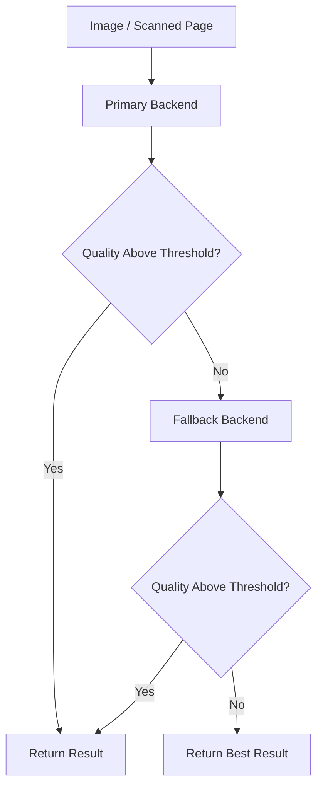
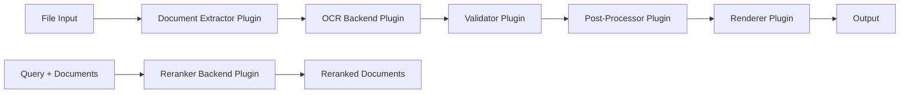

import { Tabs, TabItem } from "@astrojs/starlight/components";

A map of what Xberg can do. Each section links to the guide or reference page with configuration details and code examples.


---

## Format Support

96 file formats handled by native Rust extractors — no LibreOffice or other external tools required.

<Tabs syncKey="lang">
<TabItem label="Documents">

<div class="format-chips">
<span class="format-chip">PDF <code>.pdf</code></span>
<span class="format-chip">Word <code>.docx .doc</code></span>
<span class="format-chip">Pages <code>.pages</code></span>
<span class="format-chip">PowerPoint <code>.pptx .ppt</code></span>
<span class="format-chip">Keynote <code>.key</code></span>
<span class="format-chip">OpenDocument <code>.odt</code></span>
<span class="format-chip">Plain text <code>.txt</code></span>
<span class="format-chip">Markdown <code>.md</code></span>
<span class="format-chip">Djot <code>.djot</code></span>
<span class="format-chip">MDX <code>.mdx</code></span>
<span class="format-chip">RTF <code>.rtf</code></span>
<span class="format-chip">reStructuredText <code>.rst</code></span>
<span class="format-chip">Org <code>.org</code></span>
<span class="format-chip">Hangul <code>.hwp .hwpx</code></span>
</div>

</TabItem>
<TabItem label="Spreadsheets">

<div class="format-chips">
<span class="format-chip">Excel <code>.xlsx .xls .xlsm .xlsb</code></span>
<span class="format-chip">Numbers <code>.numbers</code></span>
<span class="format-chip">OpenDocument <code>.ods</code></span>
<span class="format-chip">CSV <code>.csv</code></span>
<span class="format-chip">TSV <code>.tsv</code></span>
<span class="format-chip">dBASE <code>.dbf</code></span>
</div>

</TabItem>
<TabItem label="Images">

<div class="format-chips">
<span class="format-chip">JPEG <code>.jpg .jpeg</code></span>
<span class="format-chip">PNG <code>.png</code></span>
<span class="format-chip">GIF <code>.gif</code></span>
<span class="format-chip">BMP <code>.bmp</code></span>
<span class="format-chip">TIFF <code>.tiff .tif</code></span>
<span class="format-chip">WebP <code>.webp</code></span>
<span class="format-chip">JPEG 2000 <code>.jp2 .jpx .jpm .mj2</code></span>
<span class="format-chip">JBIG2 <code>.jbig2</code></span>
<span class="format-chip">PNM <code>.pnm .pbm .pgm .ppm</code></span>
<span class="format-chip">HEIC <code>.heic .heics</code></span>
<span class="format-chip">HEIF <code>.heif</code></span>
<span class="format-chip">AVIF <code>.avif</code></span>
<span class="format-chip">AVCS <code>.avcs</code></span>
</div>

:::note[HEIF / HEIC / AVIF]
Pixel decoding for HEIF-family containers requires the `heic` Cargo
feature (included in `full`) and the system `libheif` library at build
and runtime. Native targets only — not available on `wasm-target` or
`android-target`. EXIF metadata extraction from HEIC / AVIF works on
every target via the pure-Rust `nom-exif` integration. See the
[installation guide](/getting-started/installation/#heif--heic--avif-support).
:::

:::caution[libheif license (LGPL)]
`libheif` is licensed under the GNU **LGPL**. Xberg links it
**dynamically** (via `pkg-config`/system shared library) and never
statically — the `heic` feature is optional and is omitted from the
standalone CLI release binaries. Container images redistribute the
unmodified upstream `libheif` as a separate shared object (`libheif.so`),
which you may replace with your own build to satisfy LGPL §6. See
[`THIRD_PARTY_LICENSES.md`](https://github.com/xberg-io/xberg/blob/main/THIRD_PARTY_LICENSES.md)
for the full notice and source pointer.
:::


</TabItem>
<TabItem label="Audio and Video">

<div class="format-chips">
<span class="format-chip">MP3 <code>.mp3 .mpga</code></span>
<span class="format-chip">M4A <code>.m4a</code></span>
<span class="format-chip">WAV <code>.wav</code></span>
<span class="format-chip">WebM audio <code>.webm</code></span>
<span class="format-chip">MP4 audio track <code>.mp4 .mpeg</code></span>
<span class="format-chip">WebM audio track <code>.webm</code></span>
</div>

Enable the `transcription` feature and set a `transcription` config block to extract Whisper ONNX transcripts from audio files and video audio tracks. See [Audio and Video Transcription](/guides/transcription/).

</TabItem>
<TabItem label="Email">

<div class="format-chips">
<span class="format-chip">EML <code>.eml</code></span>
<span class="format-chip">MSG <code>.msg</code></span>
</div>

</TabItem>
<TabItem label="Web and Markup">

<div class="format-chips">
<span class="format-chip">HTML <code>.html .htm</code></span>
<span class="format-chip">XHTML <code>.xhtml</code></span>
<span class="format-chip">XML <code>.xml</code></span>
<span class="format-chip">SVG <code>.svg</code></span>
</div>

</TabItem>
<TabItem label="Structured Data">

<div class="format-chips">
<span class="format-chip">JSON <code>.json</code></span>
<span class="format-chip">YAML <code>.yaml</code></span>
<span class="format-chip">TOML <code>.toml</code></span>
</div>

</TabItem>
<TabItem label="Archives">

<div class="format-chips">
<span class="format-chip">ZIP <code>.zip</code></span>
<span class="format-chip">TAR <code>.tar .tgz</code></span>
<span class="format-chip">GZIP <code>.gz</code></span>
<span class="format-chip">7-Zip <code>.7z</code></span>
</div>

</TabItem>
<TabItem label="Academic">

<div class="format-chips">
<span class="format-chip">EPUB <code>.epub</code></span>
<span class="format-chip">BibTeX <code>.bib</code></span>
<span class="format-chip">RIS <code>.ris</code></span>
<span class="format-chip">CSL <code>.csl</code></span>
<span class="format-chip">LaTeX <code>.tex</code></span>
<span class="format-chip">Typst <code>.typ</code></span>
<span class="format-chip">JATS <code>.jats</code></span>
<span class="format-chip">DocBook <code>.docbook</code></span>
<span class="format-chip">OPML <code>.opml</code></span>
</div>

</TabItem>
</Tabs>

For the full format matrix with MIME types, extraction methods, and special capabilities, see the [Format Support Reference](/reference/formats/).

---

## Extraction Pipeline

Every file flows through the same multi-stage pipeline:



1. **MIME detection** -- Xberg identifies the file type from magic bytes and extension, then selects the matching native extractor from the registry.
2. **Format extraction** -- The extractor pulls text, tables, metadata, and optionally images from the file. PDF extraction uses pdf_oxide (pure Rust); Office formats use native XML or OLE/CFB parsers; images pass directly to OCR.
3. **OCR** -- When the extractor finds no text layer (or `force_ocr` is set), the file is routed to the configured OCR backend. The OCR result replaces or supplements the extracted text.
4. **Post-processing** -- Validators, quality processing, chunking, embeddings, keyword extraction, and any registered post-processor plugins run in sequence.
5. **Caching** -- If caching is enabled, results are stored keyed by a content hash so repeated extractions skip the entire pipeline.

For a deep dive into each stage, see [Extraction Pipeline](/concepts/extraction-pipeline/).

### Output Formats

Xberg supports five output formats: **Plain text**, **Markdown**, **Djot**, **HTML**, and **Structured (JSON)**. The HTML format includes a styled renderer with semantic `kb-*` CSS classes, five built-in themes, and CSS custom properties for full customization. See [HTML Output](/guides/html-output/) for details.

---

## OCR Engines

OCR backends are usable individually or chained into a quality-driven fallback pipeline.

### Backend Comparison

|                    | Tesseract                                | PaddleOCR                                                          |
| ------------------ | ---------------------------------------- | ------------------------------------------------------------------ |
| **Languages**      | 100+                                     | 80+ (11 script families)                                           |
| **Best for**       | General purpose, broad language coverage | CJK, complex scripts, high accuracy                                |
| **Platform**       | Native and WASM targets                  | Native ONNX Runtime builds                                         |
| **Install**        | System package (`tesseract-ocr`)         | Cargo feature `paddle-ocr` (bundled in the Python package)         |
| **Runtime**        | C library (Tesseract 4.0+)               | ONNX Runtime (models downloaded on first use)                      |
| **Python version** | Any                                      | Any                                                                |

### Multi-Backend Pipeline

When the `paddle-ocr` feature is enabled, Xberg automatically constructs a fallback pipeline: Tesseract runs first, and if the output falls below configurable quality thresholds (16 tunable parameters), PaddleOCR takes over. You can also define a custom ordering across supported backends.

The pipeline supports auto-rotate for page orientation detection (0/90/180/270 degrees) and per-stage language and backend-specific settings.



### Document-Level Optimization

Some OCR backends support **document-level processing**. When a file path is provided, the extractor can bypass the expensive page-by-page rendering stage and delegate the entire document to the OCR engine. This significantly reduces memory overhead and improves throughput for large PDFs and multi-page images.

For backend configuration, language selection, and PSM/OEM modes, see the [OCR Guide](/guides/ocr/).

### Candle GLM-OCR

Pure-Rust VLM OCR via the `candle-glm-ocr` feature. Wraps the zai-org/GLM-OCR 0.9B-param vision-language model running natively through the candle transformer framework. No ONNX Runtime dependency.

**Feature flag:** `candle-glm-ocr`

**Implies:** `candle-ocr`, `xberg-candle-ocr/glm-ocr`, `layout-detection`

**Deployment:**

- **CPU & Metal (macOS)** — Full support
- **CUDA (Linux/Windows with NVIDIA GPU)** — Full support
- **WASM** — Excluded (candle not available on WASM)
- **Android x86_64 emulator** — Excluded (no prebuilt candle targets)

**Model & performance:**

- Model size: ~3 GB on first download; cached at `~/.cache/huggingface/`
- Default layout mode: `paired` — PP-DocLayout-V3 detects regions, per-region task-specific OCR (ocr/table/formula/chart/caption), outputs merged into reading-order markdown
- Alternative mode: `whole_page` — Single OCR pass over entire page with optional task override
- Metal dtype: F32 (BF16 matmul unavailable in candle 0.10)

Configure via `--ocr-backend candle-glm-ocr` or `ocr.backend = "candle-glm-ocr"` in config. Set layout mode and device via `backend_options`: `{"layout_mode":"paired"}`, `{"layout_mode":"whole_page"}`, `{"device":"metal"}`, `{"device":"cuda"}`.

### Candle Hunyuan-OCR

Pure-Rust VLM OCR via the `candle-hunyuan-ocr` feature. Tencent Hunyuan-OCR vision-language model with document layout understanding and multilingual support. No ONNX Runtime dependency.

**Feature flag:** `candle-hunyuan-ocr`

**Implies:** `candle-ocr`, `xberg-candle-ocr/hunyuan-ocr`

**Deployment:**

- **CPU & Metal (macOS)** — Full support
- **CUDA (Linux/Windows with NVIDIA GPU)** — Full support
- **WASM** — Excluded (candle not available on WASM)
- **Android x86_64 emulator** — Excluded (no prebuilt candle targets)

**Model & performance:**

- Model size: ~2 GB, downloaded on first use from Tencent's official ModelScope release, checksum-verified, and cached under the xberg cache directory (`XBERG_CACHE_DIR` or the platform cache dir, e.g. `~/.cache/xberg/`)
- Detects layout and text regions, outputs merged into reading-order markdown
- CPU dtype: F32; CUDA dtype: F16

Configure via `--ocr-backend candle-hunyuan-ocr` or `ocr.backend = "candle-hunyuan-ocr"` in config. Set device via `backend_options`: `{"device":"metal"}`, `{"device":"cuda"}`. To use pre-staged or offline weights, set `{"model_path":"/path/to/hunyuan-ocr"}`.

**Attribution:** Model vendored from [jhqxxx/aha](https://github.com/jhqxxx/aha) (Apache-2.0). See [ATTRIBUTIONS.md](https://github.com/xberg-io/xberg/blob/main/ATTRIBUTIONS.md).

### Candle DeepSeek-OCR

Pure-Rust VLM OCR via the `candle-deepseek-ocr` feature. DeepSeek-OCR vision-language model combining SAM, CLIP, Qwen2, and DeepSeek-V2 MoE architecture. Advanced document understanding with multilingual support. No ONNX Runtime dependency.

**Feature flag:** `candle-deepseek-ocr`

**Implies:** `candle-ocr`, `xberg-candle-ocr/deepseek-ocr`

**Deployment:**

- **CPU & Metal (macOS)** — Full support
- **CUDA (Linux/Windows with NVIDIA GPU)** — Full support
- **WASM** — Excluded (candle not available on WASM)
- **Android x86_64 emulator** — Excluded (no prebuilt candle targets)

**Model & performance:**

- Model size: ~3 GB+ on first download; cached at `~/.cache/huggingface/`
- Fine-grained layout detection, table region recognition, text extraction with confidence scores
- CPU dtype: F32; CUDA dtype: F16

Configure via `--ocr-backend candle-deepseek-ocr` or `ocr.backend = "candle-deepseek-ocr"` in config. Set device via `backend_options`: `{"device":"metal"}`, `{"device":"cuda"}`.

**Attribution:** Model vendored from [jhqxxx/aha](https://github.com/jhqxxx/aha) (Apache-2.0). See [ATTRIBUTIONS.md](https://github.com/xberg-io/xberg/blob/main/ATTRIBUTIONS.md).

### Candle PaddleOCR-VL 1.5

Pure-Rust VLM OCR via the `candle-paddleocr-vl-15` feature. PaddleOCR-VL 1.5 vision-language model with SigLIP+Ernie integration. Fast multilingual document OCR with strong CJK support. No ONNX Runtime dependency.

**Feature flag:** `candle-paddleocr-vl-15`

**Implies:** `candle-ocr`, `xberg-candle-ocr/paddleocr-vl-15`

**Deployment:**

- **CPU & Metal (macOS)** — Full support
- **CUDA (Linux/Windows with NVIDIA GPU)** — Full support
- **WASM** — Excluded (candle not available on WASM)
- **Android x86_64 emulator** — Excluded (no prebuilt candle targets)

**Model & performance:**

- Model size: ~1 GB on first download; cached at `~/.cache/huggingface/`
- Lightweight architecture optimized for speed and accuracy on scanned documents
- CPU dtype: F32; CUDA dtype: F16

Configure via `--ocr-backend candle-paddleocr-vl-15` or `ocr.backend = "candle-paddleocr-vl-15"` in config. Set device via `backend_options`: `{"device":"metal"}`, `{"device":"cuda"}`.

**Attribution:** Model vendored from [jhqxxx/aha](https://github.com/jhqxxx/aha) (Apache-2.0). See [ATTRIBUTIONS.md](https://github.com/xberg-io/xberg/blob/main/ATTRIBUTIONS.md).

### Candle VLM-OCR Umbrella

The `candle-vlm-ocr` feature aggregates all Candle VLM-OCR backends: `candle-hunyuan-ocr`, `candle-deepseek-ocr`, `candle-paddleocr-vl-15`, `candle-glm-ocr`, and `candle-trocr`. Use this aggregate to enable all pure-Rust vision-language OCR options in a single feature flag.

---

## Processing Features

Optional post-extraction steps, each configured independently through `ExtractionConfig`.

### For RAG Pipelines

**Content Chunking** -- Split extracted text into sized chunks for LLM consumption. Strategies include recursive (paragraph/sentence/word splitting), semantic, and Markdown-aware chunking that preserves heading hierarchy. Chunks can be sized by character count or by token count using any HuggingFace tokenizer.

**Embeddings** -- Generate vector embeddings locally using FastEmbed. Choose from preset models (`"fast"`, `"balanced"`, `"quality"`) or any FastEmbed-compatible model. Embeddings are generated in-process with no external API calls.

**Page Tracking** -- Extract per-page content with byte-accurate offsets for O(1) page lookups. Chunks are automatically mapped to their source pages, enabling precise citations in retrieval systems. Supported for PDF (byte-accurate), PPTX (slide boundaries), and DOCX (best-effort page breaks). See [Extraction Basics](/guides/extraction/) for usage.

**PDF Hierarchy Detection** -- Detect document structure from PDFs using K-means clustering on block characteristics (font size, weight, indentation, position). Blocks are assigned to semantic levels (title, section, subsection, paragraph) without relying on explicit heading tags. See the [Output Formats Guide](/guides/output-formats/#pdf-hierarchy-detection).

**PDF Page Rendering** -- Render individual PDF pages as PNG images for thumbnails, vision model input, or custom processing pipelines. Memory-efficient iterator renders one page at a time. Configurable DPI (default 150). Available across all language bindings. See [Extraction Guide](/guides/extraction/#pdf-page-rendering).

### LLM-Powered Intelligence

Xberg integrates with 143 LLM providers including local inference (Ollama, LM Studio, vLLM, llama.cpp) via [liter-llm](https://github.com/xberg-io/liter-llm) to unlock three new capabilities that complement the local extraction pipeline.

<details>
<summary><strong>VLM OCR</strong> -- Vision language models as an OCR backend</summary>

Use OpenAI GPT-4o, Anthropic Claude, Google Gemini, or any vision-capable model as an OCR engine. VLM OCR delivers superior accuracy on low-quality scans, handwriting, Arabic/Farsi scripts, and complex layouts where traditional OCR struggles. Configure via `ocr.backend = "vlm"` with `ocr.vlm_config` in your extraction config or `xberg.toml`.

</details>

<details>
<summary><strong>Structured Extraction</strong> -- Extract typed JSON from documents using a schema</summary>

Provide a JSON schema and an optional Jinja2 prompt template in `ExtractionConfig.structured_extraction`; unified `extract` returns conforming structured data in the extraction result. Supports strict mode with automatic `additionalProperties` sanitization for cross-provider compatibility.

```json
{
  "type": "object",
  "properties": {
    "invoice_number": { "type": "string" },
    "total": { "type": "number" },
    "line_items": {
      "type": "array",
      "items": {
        "type": "object",
        "properties": {
          "description": { "type": "string" },
          "amount": { "type": "number" }
        }
      }
    }
  }
}
```

</details>

<details>
<summary><strong>VLM Embeddings</strong> -- Provider-hosted embedding models</summary>

Use provider-hosted embedding models (for example, `openai/text-embedding-3-small`, `mistral/mistral-embed`) as an alternative to local ONNX models. Works through the existing `/embed` API endpoint, `embed_text` MCP tool, and `embed` CLI command with `--provider llm`.

</details>

<details>
<summary><strong>Custom Jinja2 Prompts</strong> -- Minijinja template engine for LLM prompts</summary>

Customize the prompts sent to LLMs with Minijinja templates. Available variables for structured extraction: `{{ content }}`, `{{ schema }}`, `{{ schema_name }}`, `{{ schema_description }}`. For VLM OCR prompts: `{{ language }}`. Override the default prompt per-request or in configuration.

</details>

`LlmConfig` and `StructuredExtractionConfig` types are exposed in Python, Node.js, and PHP bindings. Five new environment variables (`XBERG_LLM_MODEL`, `XBERG_LLM_API_KEY`, `XBERG_LLM_BASE_URL`, `XBERG_VLM_OCR_MODEL`, `XBERG_VLM_EMBEDDING_MODEL`) provide zero-code configuration.

### Document Enrichment

**Named-Entity Recognition** -- Detect people, organisations, locations, dates, money, percentages, emails, phones, URLs, and caller-supplied zero-shot labels via `xberg-gliner` (ONNX artifacts from `xberg-io/gliner-models`) or any liter-llm provider. Results populate `ExtractedDocument.entities`. See the [NER Guide](/guides/ner/).

**Redaction & Anonymisation** -- Late-stage post-processor that rewrites `content`, `formatted_content`, chunks, entities, summary, translation, and page classifications. Pattern engine covers emails, phones, SSNs, credit cards, IBANs, IP addresses, SWIFT/BIC, postal codes, dates of birth; pair with NER for PERSON / ORGANIZATION / LOCATION. Strategies: mask, hash, token-replace, drop. Caller can supply literal terms and regex patterns. See the [Redaction Guide](/guides/redaction/).

**Document Summarisation** -- Pure-Rust TextRank (extractive, local, deterministic) or any liter-llm provider (abstractive). Result on `ExtractedDocument.summary`. See the [Summarisation Guide](/guides/summarization/).

**Document Translation** -- Translate `content`, `formatted_content`, and per-chunk text into a BCP-47 target language with any liter-llm provider. Optional Markdown/HTML preservation. Result on `ExtractedDocument.translation`. See the [Translation Guide](/guides/translation/).

**Page Classification** -- Per-page LLM classification against caller-supplied labels. Single-label or multi-label. Result on `ExtractedDocument.page_classifications`. See the [Page Classification Guide](/guides/page-classification/).

**VLM Image Captions** -- Describe extracted images with any vision-capable liter-llm provider. Result on `ExtractedImage.caption`. See the [Image Captions Guide](/guides/image-captions/).

**QR-Code Detection** -- Pure-Rust `rqrr` decoder runs over extracted images. Result on `ExtractedImage.qr_codes`. Ships in `wasm-target` and `android-target`. See the [QR Codes Guide](/guides/qr-codes/).

### For Search and Indexing

**Keyword Extraction** -- Extract key phrases using YAKE (unsupervised, language-independent) or RAKE (fast statistical method). Configurable n-gram ranges and language-specific stopword filtering. See the [Keyword Extraction Guide](/guides/keywords/).

**Language Detection** -- Identify 60+ languages with confidence scoring using fast-langdetect. Supports multi-language detection for documents with mixed content.

**Metadata Extraction** -- Pull document properties (title, author, creation date), page/word/character counts, and format-specific metadata (Excel sheet names, PDF annotations).

### For Code

**Code Intelligence** -- Extract functions, classes, imports, exports, symbols, docstrings, and diagnostics from 306 programming languages via tree-sitter. Results are available in `ExtractedDocument.code_intelligence` as a `ProcessResult`. Code files produce semantic chunks (function/class-aware) that bypass the text-splitter entirely. Configure content mode with `CodeContentMode`: `chunks` (default, semantic TSLP chunks), `raw` (source as-is), or `structure` (headings + docstrings only).

### For Data Quality

**Quality Processing** -- Unicode normalization (NFC/NFD/NFKC/NFKD), whitespace and line break standardization, encoding detection, and mojibake correction.

**Token Reduction** -- Reduce token count while preserving meaning through TF-IDF-based extractive summarization. Three modes: light (~15% reduction), moderate (~30%), and aggressive (~50%).

**Table Extraction** -- Structured table data from PDFs, spreadsheets, and Word documents with cell-level row/column indexing, merged cell support, and Markdown or JSON output.

---

## Layout Detection

Detect and classify document regions using ONNX-based deep learning. Layout detection identifies 17 element types (text, tables, figures, headers, code, forms, captions, and more), enabling accurate region-aware extraction and structured table recovery.

**RT-DETR v2** -- The layout detection model that identifies document structure with high precision. Automatically selects and configures separate table structure models (TATR, SLANeXT variants, or SLANet-plus) for cell-level analysis within detected table regions.

**Table Structure Recognition** -- When layout detection identifies a table, a configurable table structure model analyzes rows, columns, headers, and spanning cells for HTML recovery with colspan/rowspan support. Choose from:

- **TATR** (30 MB) — General-purpose, fast, default
- **SLANeXT Wired/Wireless/Auto** (365–737 MB) — Optimized for bordered/borderless tables with auto-detection
- **SLANet-plus** (7.78 MB) — Lightweight, resource-constrained environments

GPU acceleration via ONNX Runtime (CUDA, CoreML, TensorRT) significantly reduces inference time. Models are automatically downloaded and cached on first use.

**Availability:** Native builds that include ONNX Runtime. It is excluded from `wasm-target`, `android-target`, and the curated `windows-target` aggregate.

For configuration and usage, see the [Layout Detection Guide](/guides/layout-detection/).

---

## Plugin System

The extraction pipeline and query-time APIs are extensible through six plugin categories:



| Plugin Type             | Purpose                                                  | Example                        |
| ----------------------- | -------------------------------------------------------- | ------------------------------ |
| **Document Extractors** | Add support for custom file formats or override defaults | Proprietary format parser      |
| **OCR Backends**        | Integrate cloud OCR services or custom engines           | AWS Textract, Google Vision    |
| **Reranker Backends**   | Score query/document pairs for search ranking            | Cross-encoder or provider API  |
| **Validators**          | Enforce quality standards on extraction results          | Minimum word count check       |
| **Post-Processors**     | Transform or enrich results after extraction             | PII redaction, custom metadata |
| **Renderers**           | Convert document structures into output formats          | Custom Markdown or HTML writer |

Plugins are registered programmatically through typed registries. Built-in plugins register at initialization when their Cargo feature is active; runtime configuration selects registered backends and processors.

For the architecture overview, see [Plugin System](/concepts/plugin-system/). For implementation guidance, see [Creating Plugins](/guides/plugins/).

---

## Deployment Modes

| Mode           | When to Use                                            | Details                                                                                  |
| -------------- | ------------------------------------------------------ | ---------------------------------------------------------------------------------------- |
| **Library**    | Embedding extraction into your application             | Import the package in Python, TypeScript, Rust, Go, Java/Kotlin JVM, Kotlin Android, Ruby, C#, PHP, Elixir, Dart, Swift, Zig, C, or Wasm |
| **CLI**        | One-off extractions, scripting, CI pipelines           | `xberg extract document.pdf --format json` -- see [CLI Usage](/cli/usage/)          |
| **REST API**   | Multi-service architectures, language-agnostic access  | `xberg serve --port 8000` -- see [API Server Guide](/guides/api-server/)            |
| **MCP Server** | AI agent integration (Claude Desktop, Continue.dev)    | `xberg mcp` -- stdio transport with JSON-RPC 2.0                                     |
| **Docker**     | Reproducible deployments with all dependencies bundled | `ghcr.io/xberg-io/xberg:latest` -- see [Docker Guide](/guides/docker/)         |

---

## Language Bindings

Polyglot bindings share the Rust core and expose the same generated types where the target platform supports the underlying feature.

### Binding Tiers

**Full feature parity with async API** -- Rust, Python (PyO3), TypeScript/Node.js (NAPI-RS)

**Full features, synchronous API** -- Go, Ruby, C#, Java, PHP, Elixir

**Native FFI surfaces** -- C, Dart, Swift, Zig, Kotlin Android

**TypeScript: Two flavors**

- **Native** (`@xberg-io/xberg`) — Full speed, complete feature parity (servers, plugins, config file discovery)
- **WASM** (`@xberg-io/xberg-wasm`) — Browser/edge runtime, 60–80% of native speed, no native dependencies required. Excluded features: ORT-dependent inference (`paddle-ocr`, layout detection, embeddings, reranker, auto-rotate, transcription), liter-llm/VLM features, server modes (`api`/`mcp`), CLI binary, and browser filesystem paths. Pure-Rust extraction formats, Tesseract WASM OCR, chunking, keywords, language detection, stopwords, tree-sitter, redaction, summarization, SVG, and QR-code detection are supported.

Choose Native for server-side Node.js; choose WASM for browser or edge deployments.

### Rust Feature Flags

Rust builds are modular through Cargo features. The default feature set is `tokio-runtime` plus `simd-utf8`; enable format and analysis features explicitly for the surface you need.

| Category              | Features                                                                                                |
| --------------------- | ------------------------------------------------------------------------------------------------------- |
| **Format extractors** | `pdf`, `excel`, `office`, `hwp`, `hwpx`, `iwork`, `email`, `html`, `xml`, `archives`, `mdx`, `svg`, `heic` |
| **OCR and ML**        | `ocr`, `ocr-wasm`, `paddle-ocr`, `layout-detection`, `embeddings`, `reranker`, `transcription`, `liter-llm` |
| **Text analysis**     | `language-detection`, `chunking`, `quality`, `keywords`, `stopwords`, `diff`, `ner`, `redaction`, `summarization`, `translation`, `classification`, `captioning`, `qr-codes` |
| **Servers**           | `api`, `mcp`, `mcp-http`, `otel`                                                                        |
| **Bundles**           | `formats`, `analysis`, `services`, `full`, `server`, `cli`, `wasm-target`, `android-target`, `windows-target` |

### Package Installation

<Tabs syncKey="lang">
<TabItem label="Python">

```bash
pip install xberg                  # Core + Tesseract + PaddleOCR
pip install xberg[all]             # Everything
```

</TabItem>
<TabItem label="TypeScript">

```bash
npm install @xberg-io/xberg            # Native (Node.js/Bun)
npm install @xberg-io/xberg-wasm            # WASM (browser/edge)
```

</TabItem>
<TabItem label="Rust">

```toml
[dependencies]
xberg = { version = "5", features = ["pdf", "ocr", "chunking"] }
```

</TabItem>
<TabItem label="Other">

```bash
gem install xberg                  # Ruby
go get github.com/xberg-io/xberg/packages/go  # Go
dotnet add package Xberg           # C#
```

</TabItem>
</Tabs>

For API details per language, see the [API Reference](/reference/api-python/).

---

## Configuration

Four configuration methods, checked in this order:

1. **Programmatic** -- Construct `ExtractionConfig` objects in code (all bindings)
2. **TOML** -- `xberg.toml`
3. **YAML** -- `xberg.yaml`
4. **JSON** -- `xberg.json`

Config files are auto-discovered from the current directory, `~/.config/xberg/`, and `/etc/xberg/`. Environment variables (`XBERG_CONFIG_PATH`, `XBERG_CACHE_DIR`, `XBERG_OCR_BACKEND`, `XBERG_OCR_LANGUAGE`) override file-based settings.

For the full configuration schema and examples, see the [Configuration Guide](/guides/configuration/).

---

## AI Coding Assistants

Xberg ships with an [Agent Skill](https://agentskills.io) that teaches AI coding assistants the complete API across Python, TypeScript, Rust, and CLI. Install it with:

```bash
npx skills add xberg-io/xberg
```

Compatible with Claude Code, Codex, Gemini CLI, Cursor, VS Code, Amp, Goose, Roo Code, and any tool supporting the Agent Skills standard. See the [AI Coding Assistants Guide](/guides/ai-coding-assistants/).

---

## Next Steps

- [Installation](/getting-started/installation/) -- Install Xberg for your language
- [Quick Start](/getting-started/quickstart/) -- Extract your first document in 5 minutes
- [Architecture](/concepts/architecture/) -- Understand the Rust core and binding layers
- [Development Workflow](/guides/development/#performance) -- Performance benchmarks and optimization guidance
