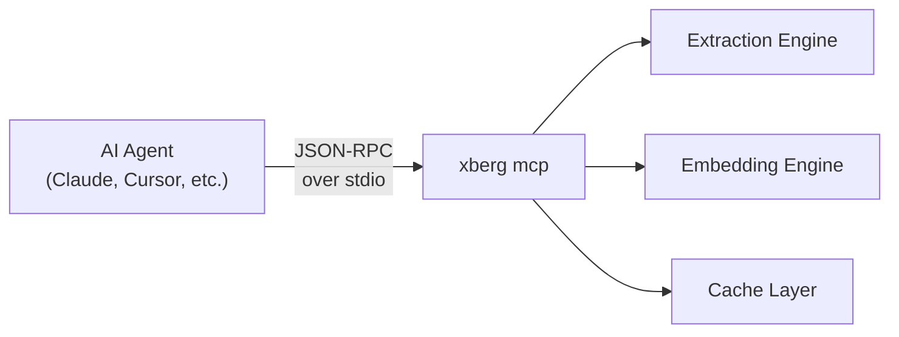

Xberg speaks [Model Context Protocol](https://modelcontextprotocol.io/). That means any AI agent — Claude, Cursor, a custom LangChain pipeline — can extract documents, generate embeddings, and manage caches through a standard tool interface without writing extraction code.

Prebuilt binaries (Homebrew, install.sh, Docker) include the MCP server. To get started:

```bash title="Terminal"
xberg mcp
```

If building from source:

```bash title="Terminal"
cargo install xberg-cli --features mcp
xberg mcp
```

That's it. You now have an MCP server running over stdio, ready for any compatible client.

---

## How It Works

The MCP server wraps Xberg's extraction engine behind standard tools, running as a child process over stdin/stdout with JSON-RPC messages — no HTTP ports or configuration needed.



---

## Server Modes

### Stdio (Default)

The standard mode for local AI tools. The agent spawns `xberg mcp` as a subprocess and communicates over pipes.

```bash title="Terminal"
xberg mcp
xberg mcp --config xberg.toml
```

This is what Claude Desktop, Cursor, and most MCP clients expect.

### HTTP Transport

:::note[Feature flag: `mcp-http`]
HTTP transport requires the `mcp-http` feature flag at build time.
:::

For remote deployments or multi-client setups where stdio doesn't work — shared servers, team environments, cloud-hosted agents — HTTP transport exposes the same tool interface over the network:

```bash title="Terminal"
xberg mcp --transport http --host 127.0.0.1 --port 8001
```

Configure in Claude Desktop or Cursor:

```json
{
  "mcpServers": {
    "xberg": {
      "command": "xberg",
      "args": ["mcp", "--transport", "http", "--host", "127.0.0.1", "--port", "8001"]
    }
  }
}
```

#### Allowed hosts behind a reverse proxy

The HTTP transport validates the inbound `Host` header and, by default, only accepts loopback hosts (`localhost`, `127.0.0.1`, `::1`) to guard against DNS-rebinding attacks. If Xberg sits behind a reverse proxy or ingress that forwards requests using a different hostname (e.g. `xberg.internal.example.com`), add that hostname to the allowlist. Supplied hosts *extend* the loopback default — they never replace it, so local health checks keep working.

Precedence (highest to lowest):

1. `--allowed-host <HOST>` CLI flag (repeatable)
2. `XBERG_MCP_ALLOWED_HOSTS` environment variable (comma-separated)
3. `[mcp] allowed_hosts` key in the config file passed via `--config` (not applied to an auto-discovered config file)
4. Default: loopback only

```bash title="Terminal"
xberg mcp --transport http --host 0.0.0.0 --port 8001 \
  --allowed-host xberg.internal.example.com --allowed-host xberg.internal.example.com:8001
```

```bash title="Terminal (env var)"
export XBERG_MCP_ALLOWED_HOSTS="xberg.internal.example.com,xberg.internal.example.com:8001"
xberg mcp --transport http --host 0.0.0.0 --port 8001
```

```toml title="xberg.toml"
[mcp]
allowed_hosts = ["xberg.internal.example.com", "xberg.internal.example.com:8001"]
```

---

## Tools

Xberg exposes MCP tools for extraction, cache operations, and metadata. All extraction tools accept an optional `config` object to override defaults:

**Extraction:** `extract`, `extract_batch`, `detect_mime_type`
**Cache:** `cache_stats`, `cache_clear`, `cache_manifest`, `cache_warm`
**Metadata:** `list_formats`, `get_version`

`extract` takes a unified `input` object — `{"kind": "uri", "uri": "<path-or-url>"}` for a local path, `file://` URI, or HTTP(S) URL, or `{"kind": "bytes", "bytes": [...], "mime_type": "<mime>"}` for raw bytes. `extract_batch` takes an `inputs` array of the same objects. Both also accept optional `pdf_password` and `response_format` (`"json"` default, or `"toon"`). `detect_mime_type` takes a `path` string.

Full parameter schemas are discoverable at runtime via the MCP client's `list_tools` call.

---

## Prompts

The server registers three guided-workflow prompts, discoverable via `list_prompts` and retrieved with `get_prompt`:

- `extract_document` — build an `extract` call for a document. Arguments: `path` (required), `output_format` (`json` default, or `toon`).
- `extract_with_ocr` — extract with explicit OCR configuration. Arguments: `path` (required), `languages` (comma-separated ISO 639 codes, e.g. `eng,deu`), `force_ocr` (`true` to force OCR even when native text exists).
- `semantic_search` — prepare a document for semantic search. Arguments: `path` (required), `preset` (`speed`, `balanced` default, or `quality`), `chunker_type` (`text` default, `markdown`, `yaml`, or `semantic`), `max_characters` (default `2000`).

---

## Resources

Static metadata is exposed at well-known `xberg://` URIs, discoverable via `list_resources` and read with `read_resource`. All return `application/json`:

- `xberg://formats` — all supported document formats and MIME types.
- `xberg://models` — model manifest with file sizes and SHA256 checksums.
- `xberg://languages/ocr` — available OCR language codes.
- `xberg://presets/embeddings` — embedding model presets (only when the `embeddings` feature is built in).

---

## Completions

The server declares the completions capability and returns argument suggestions for prompt arguments via `complete`:

- `languages` (comma-separated; completes the last segment against OCR language codes)
- `preset` (`speed`, `balanced`, `quality`)
- `chunker_type` (`text`, `markdown`, `yaml`, `semantic`)
- `output_format` (`json`, `toon`)

---

## Connecting AI Tools

### Claude Desktop

Add to `~/Library/Application Support/Claude/claude_desktop_config.json`:

```json title="claude_desktop_config.json"
{
  "mcpServers": {
    "xberg": {
      "command": "xberg",
      "args": ["mcp"]
    }
  }
}
```

Restart Claude. Xberg's tools appear automatically — ask Claude to "extract text from invoice.pdf" and it will call `extract` behind the scenes.

### Cursor

Add to `.cursor/mcp.json` in your project root:

```json title=".cursor/mcp.json"
{
  "mcpServers": {
    "xberg": {
      "command": "xberg",
      "args": ["mcp"]
    }
  }
}
```

### Python MCP Client

For building custom agent pipelines, use the official `mcp` Python SDK:

```python title="mcp_client.py"
import asyncio
from mcp import ClientSession, StdioServerParameters
from mcp.client.stdio import stdio_client

async def main() -> None:
    server_params = StdioServerParameters(
        command="xberg", args=["mcp"]
    )

    async with stdio_client(server_params) as (read, write):
        async with ClientSession(read, write) as session:
            await session.initialize()

            tools = await session.list_tools()
            print(f"Available: {[t.name for t in tools.tools]}")

            result = await session.call_tool(
                "extract",
                arguments={"input": {"kind": "uri", "uri": "document.pdf"}},
            )
            print(result)

asyncio.run(main())
```

---

## Configuration

Pass a TOML config file to set extraction defaults for all tools:

```bash title="Terminal"
xberg mcp --config xberg.toml
```

Individual tool calls override file defaults via a `config` parameter. See [ExtractionConfig Reference](/reference/configuration/) for all available fields.

---

## Running in Docker

```bash title="Terminal"
docker run ghcr.io/xberg-io/xberg:latest mcp

docker run \
  -v $(pwd)/xberg.toml:/config/xberg.toml \
  ghcr.io/xberg-io/xberg:latest \
  mcp --config /config/xberg.toml
```

For production, use Compose with a persistent cache volume so embedding models don't re-download on restart:

```yaml title="docker-compose.yaml"
services:
  xberg-mcp:
    image: ghcr.io/xberg-io/xberg:latest
    command: mcp --config /config/xberg.toml
    volumes:
      - ./xberg.toml:/config/xberg.toml:ro
      - cache-data:/app/.xberg
    restart: unless-stopped

volumes:
  cache-data:
```

---

## What to Read Next

- [API Server Guide](/guides/api-server/) — the HTTP REST API and detailed MCP tool reference
- [Docker Deployment](/guides/docker/) — container setup for all server modes
- [Configuration Reference](/reference/configuration/) — every config option explained
