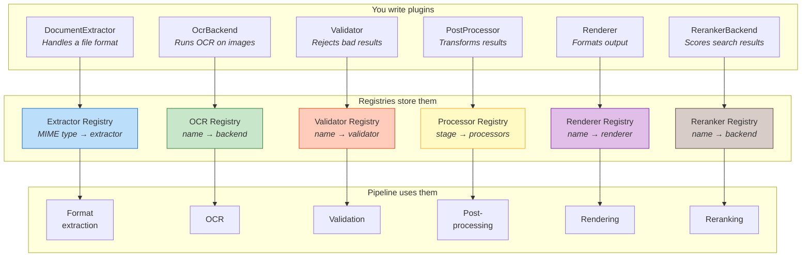
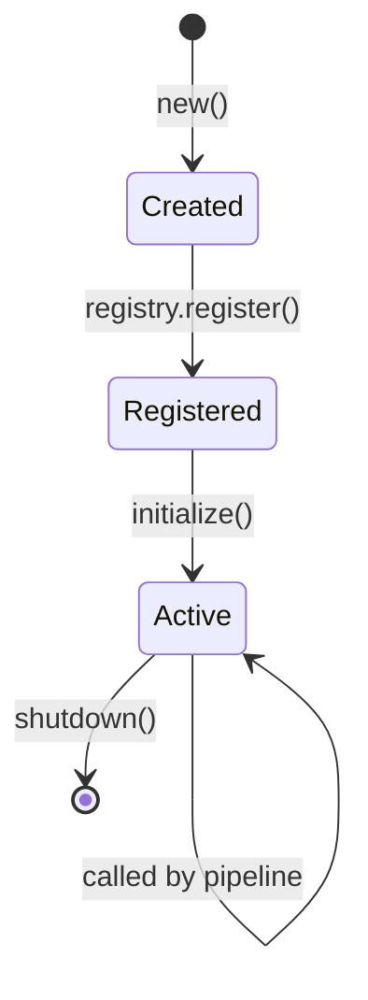
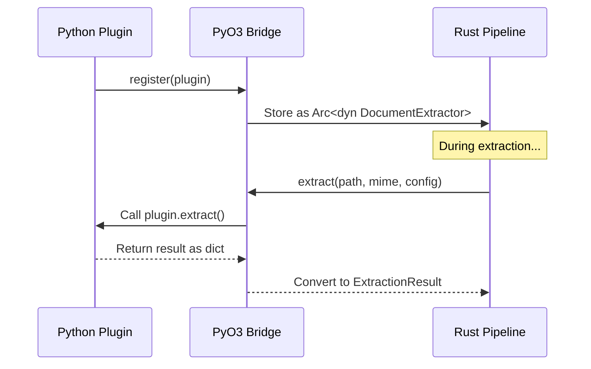

# Plugin System

Xberg's extraction pipeline is entirely plugin-driven. Every format
extractor, OCR engine, post-processor, validator, and renderer is a plugin that
registers itself into a typed registry. The pipeline queries these registries
at each stage to find the right handler. You extend Xberg by writing your
own plugin and registering it. The pipeline picks it up automatically.

This page explains the six plugin categories, the registry mechanism, the plugin
lifecycle, and how plugins work across language boundaries. `RerankerBackend`
plugins serve query-time ranking; the other categories participate in extraction.

---

## Overview

The plugin system has three layers: plugins, registries, and the pipeline.
Plugins implement a trait. Registries store them by key (MIME type, name, or
processing stage). The pipeline queries the registries during extraction.



You register a plugin once. From that point on, the pipeline uses it wherever
the MIME type, name, or stage matches. No wiring, no config files, no
boilerplate.

---

## The Six Plugin Categories

### DocumentExtractor

A `DocumentExtractor` teaches Xberg how to extract text from a specific file
format. It declares supported MIME types and provides async methods to extract
from file paths or raw bytes.

See [`DocumentExtractor`](../reference/types.md) for the trait signature.

Xberg ships with built-in extractors for PDF, Excel, images (routed to
OCR), XML, plain text, email, and Office formats (DOCX, PPTX).

**Priority resolution.** When two extractors are registered for the same MIME
type, the one with the higher `priority()` value wins. Every built-in extractor
has a priority of 0. To override the built-in PDF extractor with your own,
register yours with a higher priority:

```rust title="override_builtin.rs"
impl DocumentExtractor for BetterPDFExtractor {
    fn priority(&self) -> i32 { 100 }
    // ...
}
```

Now when the pipeline encounters `application/pdf`, it selects `BetterPDFExtractor` instead of the default.

---

### OcrBackend

An `OcrBackend` performs optical character recognition on image data. It
declares supported languages and provides async methods to process image bytes
or files.

See [`OcrBackend`](../reference/types.md) for the trait signature.

Three backends ship out of the box:

| Backend       | Engine               | Strengths                                                                                         |
| ------------- | -------------------- | ------------------------------------------------------------------------------------------------- |
| **Tesseract** | Native Rust bindings | Fast, general-purpose, default backend. Good accuracy for Latin scripts.                          |
| **PaddleOCR** | ONNX Runtime         | Best accuracy for CJK (Chinese, Japanese, Korean) scripts. No Python dependency.                  |
| **EasyOCR**   | Python + PyTorch     | Supports 80+ languages including Arabic, Hindi, and Thai. Only available through Python bindings. |

You can register your own OCR backend (for example, a cloud-based API, a custom model) using the same trait.

---

### RerankerBackend

A `RerankerBackend` scores (query, document) pairs jointly for query-time relevance ranking. It
declares a backend name and provides an async method to rank documents.

See [`RerankerBackend`](../reference/types.md) for the trait signature.

Four backends ship out of the box:

| Backend | Engine | Strengths |
|---------|--------|-----------|
| **fast** | Xenova/ms-marco-MiniLM-L-6-v2 (ONNX) | 22M params, <1 sec/10 docs, English only. |
| **balanced** | Xenova/bge-reranker-base (ONNX) | 278M params, 1-2 sec/10 docs, English/Chinese. |
| **quality** | Xenova/bge-reranker-large (ONNX) | 560M params, 2-3 sec/10 docs, English/Chinese, highest accuracy. |
| **multilingual** | Xenova/bge-reranker-v2-m3 (ONNX) | 568M params, 100+ languages, 8192 token limit. |

Custom backends can wrap HuggingFace models, LLM APIs (Cohere, Jina, Voyage), or domain-specific
rerankers. Unlike extraction, reranking is not part of the extraction pipeline — it's a query-time
operation for RAG workflows to reorder retrieved documents before LLM context.

---

### PostProcessor

A `PostProcessor` transforms extraction results after the main extraction and
OCR stages are complete. Each processor declares a processing stage that
determines its execution order.

See [`PostProcessor`](../reference/types.md) for the trait signature.

The three stages execute in fixed order:

| Stage    | Runs   | Purpose              | Examples                                                        |
| -------- | ------ | -------------------- | --------------------------------------------------------------- |
| `Early`  | First  | Clean up raw text    | Strip control characters, fix encoding, normalize whitespace    |
| `Middle` | Second | Analyze content      | Extract named entities, detect language, classify document type |
| `Late`   | Third  | Final output shaping | Format output, generate summaries, redact PII                   |

**Error handling:** Post-processor errors do not fail the extraction. Errors are
logged and the pipeline continues unchanged, ensuring no processor can take down
extraction.

---

### Validator

A `Validator` inspects extraction results and can reject them if they don't meet
requirements. Unlike post-processors, validator errors stop the pipeline
immediately — they're a hard gate.

See [`Validator`](../reference/types.md) for the trait signature.

Two common validator patterns:

```python title="example_validators.py"
class MinimumLengthValidator:
    """Reject extractions that produce less than 100 characters."""
    def validate(self, result, config):
        if len(result.content) < 100:
            raise ValidationError("Text too short")

class QualityThresholdValidator:
    """Reject extractions with a quality score below 0.5."""
    def validate(self, result, config):
        if (result.quality_score or 0.0) < 0.5:
            raise ValidationError("Quality below threshold")
```

Validators run before post-processors. This means you can catch and reject bad results before any transformation work happens.

---

### Renderer

A `Renderer` converts the internal document representation into a specific output
format. It declares a name and provides a render method.

```rust
pub trait Renderer: Send + Sync {
    fn name(&self) -> &str;
    fn render(&self, document: &InternalDocument) -> Result<String>;
}
```

Xberg ships with four built-in renderers:

| Renderer     | Output       | Description                                                              |
| ------------ | ------------ | ------------------------------------------------------------------------ |
| **Markdown** | GFM Markdown | GitHub Flavored Markdown via comrak AST bridge. Tables, headings, lists. |
| **HTML**     | HTML5        | Full HTML5 rendering via comrak.                                         |
| **djot**     | Djot         | Djot markup format.                                                      |
| **plain**    | Plain text   | Raw text with no markup.                                                 |

To register a custom renderer:

```rust title="custom_renderer.rs"
use xberg::plugins::registry::get_renderer_registry;
use std::sync::Arc;

let registry = get_renderer_registry();
let mut registry = registry.write().unwrap();
registry.register(Arc::new(MyCustomRenderer))?;
```

Custom renderers participate in the pipeline just like built-in ones. When the user
requests your renderer's name via `--content-format`, the RendererRegistry
dispatches to your implementation.

---

## Plugin Lifecycle

Every plugin follows the same lifecycle from creation to shutdown.



See [`Plugin`](../reference/types.md) for the base trait signature.

Key behaviors: `initialize()` is called lazily the first time the plugin is used,
not at registration. This avoids startup overhead for plugins that may never be
invoked. `shutdown()` runs when the plugin is unregistered or on process exit.
Both have default no-op implementations — override only if your plugin needs
setup or cleanup.

---

## Registering Plugins

Get the appropriate registry for your plugin type and call `register()`. Once
registered, the pipeline automatically dispatches to your plugin based on MIME
type (extractors), backend name (OCR), processing stage (post-processors), or
validator name.

---

## Cross-Language Plugins

Plugins written in Python can integrate directly with the Rust extraction pipeline
via PyO3 FFI. The bridge layer handles all type conversion automatically.



Type mapping: `Vec<u8>` ↔ `bytes`, `String` ↔ `str`, Rust structs ↔ Python dataclasses.
Large buffers use Python's buffer protocol to minimize copying.

---

## Thread Safety

All plugins must implement `Send + Sync` because the extraction pipeline invokes
them concurrently from Tokio's worker thread pool. For mutable internal state, use
`Mutex`, `RwLock`, or atomic types. The compiler will enforce this requirement.

---

## Plugin Discovery

Plugins can be registered in two ways:

1. **Built-in** — automatically registered when Xberg initializes. These are the
   default extractors, OCR backends, and processors. The seven OSS v5 enrichment
   processors (NER, redaction, summarisation, translation, page classification,
   image captioning, QR-code detection) all register through the shared
   `register_builtin()` umbrella in `crates/xberg/src/plugins/processor/builtin/mod.rs`.
   Each is gated behind its Cargo feature (`ner`, `redaction`, `summarization`,
   `translation`, `classification`, `captioning`, `qr-codes`) and only joins the
   registry when the feature is active.
2. **Programmatic** — registered manually via the registry API at runtime.

---

## What to Read Next

- [Creating Plugins](../guides/plugins.md) — step-by-step guide to building a custom plugin
- [Extraction Pipeline](extraction-pipeline.md) — where each plugin type fits in the extraction flow
- [Architecture](architecture.md) — overall system design
- [API Reference](../reference/api-python.md) — plugin API documentation
