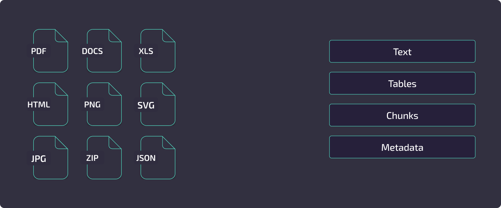
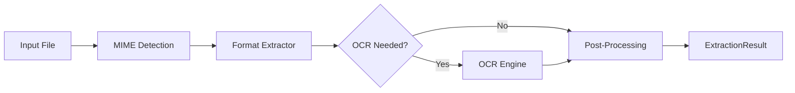
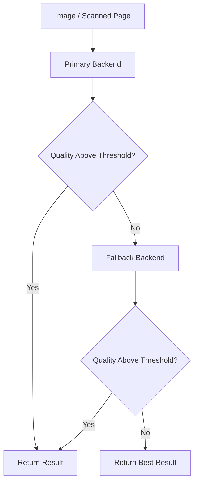
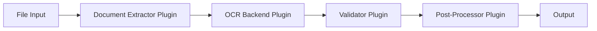

# Features

Kreuzberg is a document intelligence library built on a Rust core with bindings for 12 languages. It extracts text, tables, and metadata from 91+ file formats, runs OCR when needed, and feeds the results through a configurable post-processing pipeline -- chunking, embeddings, keyword extraction, and more.

This page is a map of what Kreuzberg can do. Each section links to the guide or reference page where you will find configuration details and code examples.



---

## Format Support

Kreuzberg handles 91+ file formats through native Rust extractors. No external tools such as LibreOffice are required.

=== "Documents"

    <div class="format-chips">
    <span class="format-chip">PDF <code>.pdf</code></span>
    <span class="format-chip">Word <code>.docx .doc</code></span>
    <span class="format-chip">Pages <code>.pages</code></span>
    <span class="format-chip">PowerPoint <code>.pptx .ppt</code></span>
    <span class="format-chip">Keynote <code>.key</code></span>
    <span class="format-chip">OpenDocument <code>.odt</code></span>
    <span class="format-chip">Plain text <code>.txt</code></span>
    <span class="format-chip">Markdown <code>.md</code></span>
    <span class="format-chip">Djot <code>.djot</code></span>
    <span class="format-chip">MDX <code>.mdx</code></span>
    <span class="format-chip">RTF <code>.rtf</code></span>
    <span class="format-chip">reStructuredText <code>.rst</code></span>
    <span class="format-chip">Org <code>.org</code></span>
    <span class="format-chip">Hangul <code>.hwp .hwpx</code></span>
    </div>

=== "Spreadsheets"

    <div class="format-chips">
    <span class="format-chip">Excel <code>.xlsx .xls .xlsm .xlsb</code></span>
    <span class="format-chip">Numbers <code>.numbers</code></span>
    <span class="format-chip">OpenDocument <code>.ods</code></span>
    <span class="format-chip">CSV <code>.csv</code></span>
    <span class="format-chip">TSV <code>.tsv</code></span>
    <span class="format-chip">dBASE <code>.dbf</code></span>
    </div>

=== "Images"

    <div class="format-chips">
    <span class="format-chip">JPEG <code>.jpg .jpeg</code></span>
    <span class="format-chip">PNG <code>.png</code></span>
    <span class="format-chip">GIF <code>.gif</code></span>
    <span class="format-chip">BMP <code>.bmp</code></span>
    <span class="format-chip">TIFF <code>.tiff .tif</code></span>
    <span class="format-chip">WebP <code>.webp</code></span>
    <span class="format-chip">JPEG 2000 <code>.jp2 .jpx .jpm .mj2</code></span>
    <span class="format-chip">JBIG2 <code>.jbig2</code></span>
    <span class="format-chip">PNM <code>.pnm .pbm .pgm .ppm</code></span>
    </div>

=== "Email"

    <div class="format-chips">
    <span class="format-chip">EML <code>.eml</code></span>
    <span class="format-chip">MSG <code>.msg</code></span>
    </div>

=== "Web and Markup"

    <div class="format-chips">
    <span class="format-chip">HTML <code>.html .htm</code></span>
    <span class="format-chip">XHTML <code>.xhtml</code></span>
    <span class="format-chip">XML <code>.xml</code></span>
    <span class="format-chip">SVG <code>.svg</code></span>
    </div>

=== "Structured Data"

    <div class="format-chips">
    <span class="format-chip">JSON <code>.json</code></span>
    <span class="format-chip">YAML <code>.yaml</code></span>
    <span class="format-chip">TOML <code>.toml</code></span>
    </div>

=== "Archives"

    <div class="format-chips">
    <span class="format-chip">ZIP <code>.zip</code></span>
    <span class="format-chip">TAR <code>.tar .tgz</code></span>
    <span class="format-chip">GZIP <code>.gz</code></span>
    <span class="format-chip">7-Zip <code>.7z</code></span>
    </div>

=== "Academic"

    <div class="format-chips">
    <span class="format-chip">EPUB <code>.epub</code></span>
    <span class="format-chip">BibTeX <code>.bib</code></span>
    <span class="format-chip">RIS <code>.ris</code></span>
    <span class="format-chip">CSL <code>.csl</code></span>
    <span class="format-chip">LaTeX <code>.tex</code></span>
    <span class="format-chip">Typst <code>.typ</code></span>
    <span class="format-chip">JATS <code>.jats</code></span>
    <span class="format-chip">DocBook <code>.docbook</code></span>
    <span class="format-chip">OPML <code>.opml</code></span>
    </div>

For the full format matrix with MIME types, extraction methods, and special capabilities, see the [Format Support Reference](reference/formats.md).

---

## Extraction Pipeline

Every file -- whether a single PDF or a batch of thousands -- flows through the same multi-stage pipeline:



1. **MIME detection** -- Kreuzberg identifies the file type from magic bytes and extension, then selects the matching native extractor from the registry.
2. **Format extraction** -- The extractor pulls text, tables, metadata, and optionally images from the file. PDF extraction uses pdfium; Office formats use streaming XML parsers; images pass directly to OCR.
3. **OCR** -- When the extractor finds no text layer (or `force_ocr` is set), the file is routed to the configured OCR backend. The OCR result replaces or supplements the extracted text.
4. **Post-processing** -- Validators, quality processing, chunking, embeddings, keyword extraction, and any registered post-processor plugins run in sequence.
5. **Caching** -- If caching is enabled, results are stored keyed by a content hash so repeated extractions skip the entire pipeline.

For a deep dive into each stage, see [Extraction Pipeline](concepts/extraction-pipeline.md).

---

## OCR Engines

Kreuzberg supports three OCR backends. You can use one backend, or chain multiple backends into a fallback pipeline that automatically retries with the next engine when quality is low.

### Backend Comparison

| | Tesseract | PaddleOCR | EasyOCR |
|---|---|---|---|
| **Languages** | 100+ | 80+ (11 script families) | 80+ |
| **Best for** | General purpose, broad language coverage | CJK, complex scripts, high accuracy | GPU-accelerated workloads |
| **Platform** | All bindings including WASM | All non-WASM bindings | Python only |
| **Install** | System package (`tesseract-ocr`) | Cargo feature `paddle-ocr` or `pip install kreuzberg[paddleocr]` | `pip install kreuzberg[easyocr]` |
| **Runtime** | C library (Tesseract 4.0+) | ONNX Runtime (models downloaded on first use) | PyTorch (optional CUDA) |
| **Python version** | Any | Native: any. Python package: <3.14 | <3.14 |

### Multi-Backend Pipeline

!!! info "Added in v4.5.0"

When the `paddle-ocr` feature is enabled, Kreuzberg automatically constructs a fallback pipeline: Tesseract runs first, and if the output falls below configurable quality thresholds (16 tunable parameters), PaddleOCR takes over. You can also define a custom ordering across all three backends.

The pipeline supports auto-rotate for page orientation detection (0/90/180/270 degrees) and per-stage language and backend-specific settings.



### Document-Level Optimization

!!! info "Added in v4.5.3"

Some OCR backends (including EasyOCR) now support **document-level processing**. When a file path is provided, the extractor can bypass the expensive page-by-page rendering stage and delegate the entire document to the OCR engine. This significantly reduces memory overhead and improves throughput for large PDFs and multi-page images.

For backend configuration, language selection, and PSM/OEM modes, see the [OCR Guide](guides/ocr.md).

---

## Processing Features

After extraction, Kreuzberg can run a chain of processing steps. Each is optional and configured independently through `ExtractionConfig`.

### For RAG Pipelines

**Content Chunking** -- Split extracted text into sized chunks for LLM consumption. Strategies include recursive (paragraph/sentence/word splitting), semantic, and Markdown-aware chunking that preserves heading hierarchy. Chunks can be sized by character count or by token count using any HuggingFace tokenizer.

**Embeddings** -- Generate vector embeddings locally using FastEmbed. Choose from preset models (`"fast"`, `"balanced"`, `"quality"`) or any FastEmbed-compatible model. Embeddings are generated in-process with no external API calls.

**Page Tracking** -- Extract per-page content with byte-accurate offsets for O(1) page lookups. Chunks are automatically mapped to their source pages, enabling precise citations in retrieval systems. Supported for PDF (byte-accurate), PPTX (slide boundaries), and DOCX (best-effort page breaks). See [Extraction Basics](guides/extraction.md) for usage.

**PDF Hierarchy Detection** -- Detect document structure from PDFs using K-means clustering on block characteristics (font size, weight, indentation, position). Blocks are assigned to semantic levels (title, section, subsection, paragraph) without relying on explicit heading tags. See the [PDF Hierarchy Guide](guides/pdf-hierarchy.md).

**PDF Page Rendering** -- Render individual PDF pages as PNG images for thumbnails, vision model input, or custom processing pipelines. Memory-efficient iterator renders one page at a time. Configurable DPI (default 150). Available across all language bindings. See [PDF Rendering Guide](guides/pdf-rendering.md).

!!! info "Added in v4.6.2"

### For Search and Indexing

**Keyword Extraction** -- Extract key phrases using YAKE (unsupervised, language-independent) or RAKE (fast statistical method). Configurable n-gram ranges and language-specific stopword filtering. See the [Keyword Extraction Guide](guides/keywords.md).

**Language Detection** -- Identify 60+ languages with confidence scoring using fast-langdetect. Supports multi-language detection for documents with mixed content.

**Metadata Extraction** -- Pull document properties (title, author, creation date), page/word/character counts, and format-specific metadata (Excel sheet names, PDF annotations).

### For Data Quality

**Quality Processing** -- Unicode normalization (NFC/NFD/NFKC/NFKD), whitespace and line break standardization, encoding detection, and mojibake correction.

**Token Reduction** -- Reduce token count while preserving meaning through TF-IDF-based extractive summarization. Three modes: light (~15% reduction), moderate (~30%), and aggressive (~50%).

**Table Extraction** -- Structured table data from PDFs, spreadsheets, and Word documents with cell-level row/column indexing, merged cell support, and Markdown or JSON output.

---

## Layout Detection

!!! info "Added in v4.5.0"

Detect and classify document regions using ONNX-based deep learning models. Layout detection identifies tables, figures, headers, text blocks, code sections, forms, and more, then feeds that structure into extraction for better accuracy.

### Model Presets

| Preset | Model | Element Classes | Use Case |
|---|---|---|---|
| `"fast"` | YOLO | 11 | High-throughput pipelines, general documents |
| `"accurate"` | RT-DETR v2 | 17 | Complex layouts, forms, mixed-content pages |

Layout detection includes SLANet table structure recognition for HTML table recovery with colspan/rowspan, heading detection with confidence-based overrides, and GPU acceleration via ONNX Runtime (CUDA, CoreML, TensorRT).

Models are automatically downloaded and cached from HuggingFace on first use. Available across all language bindings **except WebAssembly** -- WASM does not support layout detection because ONNX Runtime is unavailable in browser environments.

For configuration and usage examples, see the [Layout Detection Guide](guides/layout-detection.md).

---

## Plugin System

Kreuzberg's extraction pipeline is extensible through four plugin types, each hooking into a different stage:



| Plugin Type | Purpose | Example |
|---|---|---|
| **Document Extractors** | Add support for custom file formats or override defaults | Proprietary format parser |
| **OCR Backends** | Integrate cloud OCR services or custom engines | AWS Textract, Google Vision |
| **Validators** | Enforce quality standards on extraction results | Minimum word count check |
| **Post-Processors** | Transform or enrich results after extraction | PII redaction, custom metadata |

Plugins are registered with a priority value that determines execution order. Discovery works through Python entry points, configuration files, or environment variables.

For the architecture overview, see [Plugin System](concepts/plugin-system.md). For implementation guidance, see [Creating Plugins](guides/plugins.md).

---

## Deployment Modes

| Mode | When to Use | Details |
|---|---|---|
| **Library** | Embedding extraction into your application | Import the package in Python, TypeScript, Rust, Go, Ruby, C#, Java, PHP, Elixir, R, or C |
| **CLI** | One-off extractions, scripting, CI pipelines | `kreuzberg extract document.pdf --format json` -- see [CLI Usage](cli/usage.md) |
| **REST API** | Multi-service architectures, language-agnostic access | `kreuzberg serve --port 8000` -- see [API Server Guide](guides/api-server.md) |
| **MCP Server** | AI agent integration (Claude Desktop, Continue.dev) | `kreuzberg mcp` -- stdio transport with JSON-RPC 2.0 |
| **Docker** | Reproducible deployments with all dependencies bundled | `ghcr.io/kreuzberg-dev/kreuzberg:latest` -- see [Docker Guide](guides/docker.md) |

---

## Language Bindings

Kreuzberg's Rust core is exposed through native bindings for 12 languages. All bindings share the same extraction engine and produce identical results.

### Binding Tiers

**Full feature parity with async API** -- Python (PyO3), TypeScript/Node.js (NAPI-RS), Rust

**Full features, synchronous API** -- Go, Ruby, C#, Java

**Subset or constrained environment** -- TypeScript/WASM (browser/edge, no filesystem or server modes), PHP, Elixir, R, C (FFI)

!!! note "TypeScript: Native vs WASM"
    **Native** (`@kreuzberg/node`) runs at full speed with complete feature parity including servers, plugins, and config file discovery. **WASM** (`@kreuzberg/wasm`) runs in browsers and edge runtimes at 60-80% of native speed with no native dependencies, but lacks filesystem access, server modes, file-based configuration, layout detection (requires ONNX Runtime), hardware acceleration config, concurrency config, and email config. Choose Native for server-side Node.js; choose WASM for browser or edge deployments.

### Rust Feature Flags

Rust builds are modular through Cargo features. Nothing is enabled by default -- you opt into exactly what you need:

| Category | Features |
|---|---|
| **Format extractors** | `pdf`, `excel`, `office`, `email`, `html`, `xml`, `archives`, `markdown`, `djot`, `mdx` |
| **Processing** | `ocr`, `paddle-ocr`, `language-detection`, `chunking`, `embeddings`, `quality`, `keywords`, `stopwords` |
| **Servers** | `api`, `mcp` |
| **Bundles** | `full` (all extractors + processing), `server`, `cli` |

### Package Installation

=== "Python"

    ```bash
    pip install kreuzberg                  # Core + Tesseract
    pip install kreuzberg[paddleocr]       # + PaddleOCR
    pip install kreuzberg[easyocr]         # + EasyOCR
    pip install kreuzberg[all]             # Everything
    ```

=== "TypeScript"

    ```bash
    npm install @kreuzberg/node            # Native (Node.js/Bun)
    npm install @kreuzberg/wasm            # WASM (browser/edge)
    ```

=== "Rust"

    ```toml
    [dependencies]
    kreuzberg = { version = "4.0", features = ["pdf", "ocr", "chunking"] }
    ```

=== "Other"

    ```bash
    gem install kreuzberg                  # Ruby
    go get github.com/kreuzberg-dev/kreuzberg/packages/go/v4  # Go
    dotnet add package kreuzberg.dev       # C#
    ```

For API details per language, see the [API Reference](reference/api-python.md).

---

## Configuration

Kreuzberg supports four configuration methods, checked in this order:

1. **Programmatic** -- Construct `ExtractionConfig` objects in code (all bindings)
2. **TOML** -- `kreuzberg.toml`
3. **YAML** -- `kreuzberg.yaml`
4. **JSON** -- `kreuzberg.json`

Config files are auto-discovered from the current directory, `~/.config/kreuzberg/`, and `/etc/kreuzberg/`. Environment variables (`KREUZBERG_CONFIG_PATH`, `KREUZBERG_CACHE_DIR`, `KREUZBERG_OCR_BACKEND`, `KREUZBERG_OCR_LANGUAGE`) override file-based settings.

For the full configuration schema and examples, see the [Configuration Guide](guides/configuration.md).

---

## AI Coding Assistants

!!! info "Added in v4.2.15"

Kreuzberg ships with an [Agent Skill](https://agentskills.io) that teaches AI coding assistants the complete API across Python, TypeScript, Rust, and CLI. Install it with:

```bash
npx skills add kreuzberg-dev/kreuzberg
```

Compatible with Claude Code, Codex, Gemini CLI, Cursor, VS Code, Amp, Goose, Roo Code, and any tool supporting the Agent Skills standard. See the [AI Coding Assistants Guide](guides/agent-skills.md).

---

## Next Steps

- [Installation](getting-started/installation.md) -- Install Kreuzberg for your language
- [Quick Start](getting-started/quickstart.md) -- Extract your first document in 5 minutes
- [Architecture](concepts/architecture.md) -- Understand the Rust core and binding layers
- [Performance](concepts/performance.md) -- Benchmarks and optimization guidance
