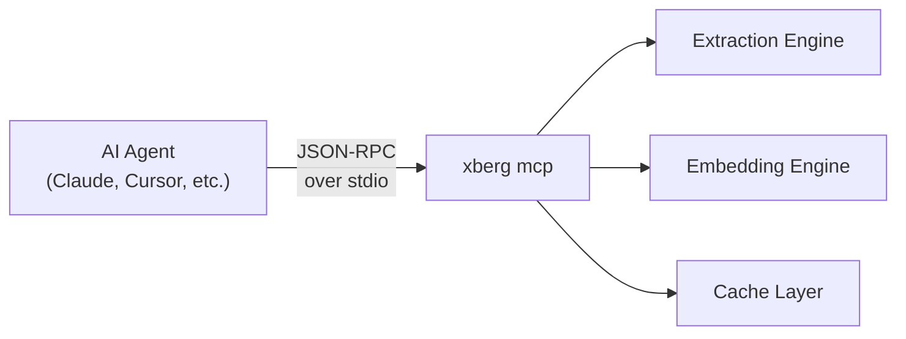

# MCP Integration

Xberg speaks [Model Context Protocol](https://modelcontextprotocol.io/). That means any AI agent — Claude, Cursor, a custom LangChain pipeline — can extract documents, generate embeddings, and manage caches through a standard tool interface without writing extraction code.

Prebuilt binaries (Homebrew, install.sh, Docker) include the MCP server. To get started:

```bash title="Terminal"
xberg mcp
```

If building from source:

```bash title="Terminal"
cargo install xberg-cli --features mcp
xberg mcp
```

That's it. You now have an MCP server running over stdio, ready for any compatible client.

---

## How It Works

The MCP server wraps Xberg's extraction engine behind standard tools, running as a child process over stdin/stdout with JSON-RPC messages — no HTTP ports or configuration needed.



---

## Server Modes

### Stdio (Default)

The standard mode for local AI tools. The agent spawns `xberg mcp` as a subprocess and communicates over pipes.

```bash title="Terminal"
xberg mcp
xberg mcp --config xberg.toml
```

This is what Claude Desktop, Cursor, and most MCP clients expect.

### HTTP Transport

!!! Info "Feature flag: `mcp-http`"

    HTTP transport requires the `mcp-http` feature flag at build time.

For remote deployments or multi-client setups where stdio doesn't work — shared servers, team environments, cloud-hosted agents — HTTP transport exposes the same tool interface over the network:

```bash title="Terminal"
xberg mcp --transport http --host 127.0.0.1 --port 8001
```

Configure in Claude Desktop or Cursor:

```json
{
  "mcpServers": {
    "xberg": {
      "command": "xberg",
      "args": ["mcp", "--transport", "http", "--host", "127.0.0.1", "--port", "8001"]
    }
  }
}
```

---

## Tools

Xberg exposes 13 tools via MCP. All extraction tools accept an optional `config` object to override defaults:

**Extraction:** `extract`, `extract_batch`, `detect_mime_type`, `extract_structured`
**Embeddings:** `embed_text`
**Chunking:** `chunk_text`
**Cache:** `cache_stats`, `cache_clear`, `cache_manifest`, `cache_warm`
**Metadata:** `list_formats`, `get_version`

`extract_structured` requires the server to be built with the `liter-llm` feature. Full parameter schemas are discoverable at runtime via the MCP client's `list_tools` call.

---

## Connecting AI Tools

### Claude Desktop

Add to `~/Library/Application Support/Claude/claude_desktop_config.json`:

```json title="claude_desktop_config.json"
{
  "mcpServers": {
    "xberg": {
      "command": "xberg",
      "args": ["mcp"]
    }
  }
}
```

Restart Claude. Xberg's tools appear automatically — ask Claude to "extract text from invoice.pdf" and it will call `extract` behind the scenes.

### Cursor

Add to `.cursor/mcp.json` in your project root:

```json title=".cursor/mcp.json"
{
  "mcpServers": {
    "xberg": {
      "command": "xberg",
      "args": ["mcp"]
    }
  }
}
```

### Python MCP Client

For building custom agent pipelines, use the official `mcp` Python SDK:

```python title="mcp_client.py"
import asyncio
from mcp import ClientSession, StdioServerParameters
from mcp.client.stdio import stdio_client

async def main() -> None:
    server_params = StdioServerParameters(
        command="xberg", args=["mcp"]
    )

    async with stdio_client(server_params) as (read, write):
        async with ClientSession(read, write) as session:
            await session.initialize()

            tools = await session.list_tools()
            print(f"Available: {[t.name for t in tools.tools]}")

            result = await session.call_tool(
                "extract",
                arguments={"path": "document.pdf"},
            )
            print(result)

asyncio.run(main())
```

### Spawning from Python

If your application manages the server lifecycle directly:

```python title="spawn_server.py"
import subprocess

process = subprocess.Popen(
    ["python", "-m", "xberg", "mcp"],
    stdout=subprocess.PIPE,
    stderr=subprocess.PIPE,
)
print(f"MCP server running (PID {process.pid})")
```

---

## Configuration

Pass a TOML config file to set extraction defaults for all tools:

```bash title="Terminal"
xberg mcp --config xberg.toml
```

Individual tool calls override file defaults via a `config` parameter. See [ExtractionConfig Reference](../reference/configuration.md) for all available fields.

---

## Running in Docker

```bash title="Terminal"
docker run ghcr.io/xberg-io/xberg:latest mcp

docker run \
  -v $(pwd)/xberg.toml:/config/xberg.toml \
  ghcr.io/xberg-io/xberg:latest \
  mcp --config /config/xberg.toml
```

For production, use Compose with a persistent cache volume so embedding models don't re-download on restart:

```yaml title="docker-compose.yaml"
services:
  xberg-mcp:
    image: ghcr.io/xberg-io/xberg:latest
    command: mcp --config /config/xberg.toml
    volumes:
      - ./xberg.toml:/config/xberg.toml:ro
      - cache-data:/app/.xberg
    restart: unless-stopped

volumes:
  cache-data:
```

---

## What to Read Next

- [API Server Guide](api-server.md) — the HTTP REST API and detailed MCP tool reference
- [Docker Deployment](docker.md) — container setup for all server modes
- [Configuration Reference](../reference/configuration.md) — every config option explained
