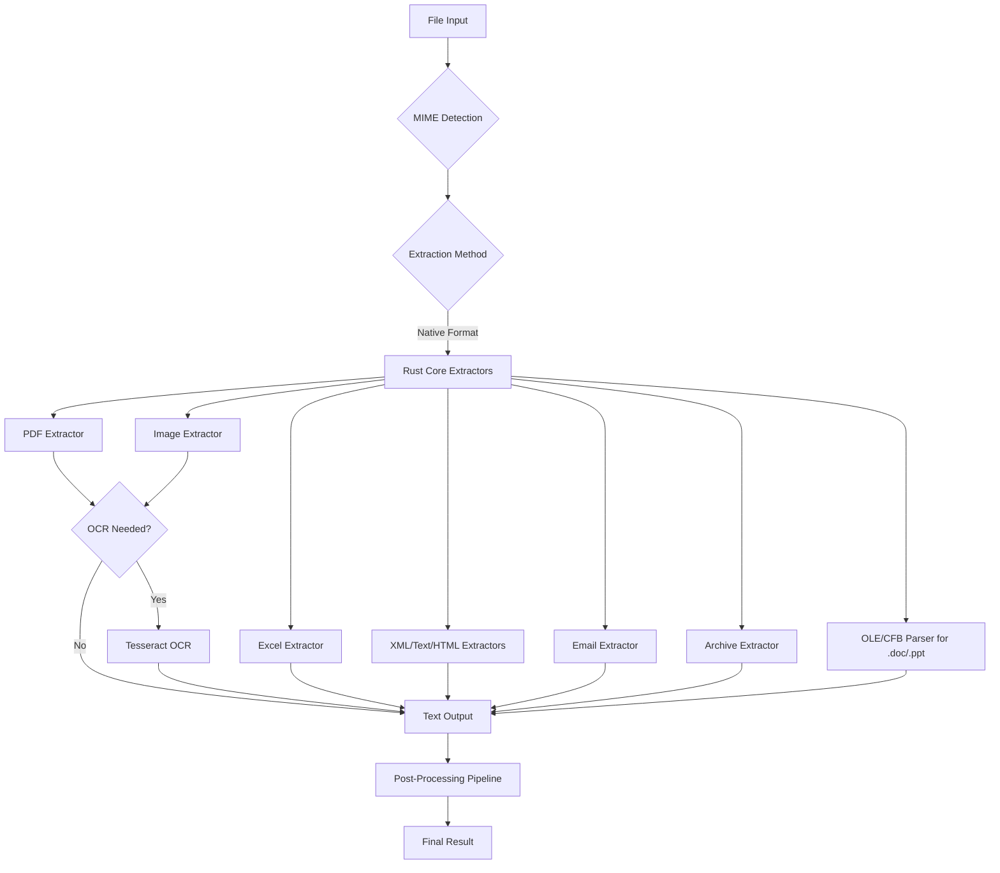

# Format Support

Xberg supports 96 file formats across major categories through native Rust extractors.

## Overview

Xberg uses a high-performance Rust core with one registry-backed extraction path:

- **Native Rust Extractors**: Fast, memory-efficient extractors for all supported formats

PDF extraction uses the pdf_oxide provider. Legacy `.doc` and `.ppt` extraction no longer requires LibreOffice; those formats are parsed through native OLE/CFB extractors.

Call `list_supported_formats()` in SDKs or the REST/API layer to inspect the runtime registry, including extensions and MIME types.

All formats support async/await and batch processing. Image formats and PDFs support optional OCR when configured.

## Format Support Matrix

### Office Documents

| Format                   | Extensions                                                                  | MIME Type                                                                   | Extraction Method       | OCR Support               | Special Features                                            |
| ------------------------ | --------------------------------------------------------------------------- | --------------------------------------------------------------------------- | ----------------------- | ------------------------- | ----------------------------------------------------------- |
| PDF                      | `.pdf`                                                                      | `application/pdf`                                                           | Native Rust (pdf_oxide) | Yes                       | Metadata extraction, image extraction, text layer detection |
| Excel                    | `.xlsx`, `.xlsm`, `.xlsb`, `.xls`, `.xlam`, `.xla`, `.xltx`, `.xlt`, `.ods` | Various Excel MIME types                                                    | Native Rust (calamine)  | No                        | Multi-sheet support, formula preservation                   |
| PowerPoint               | `.pptx`, `.pptm`, `.ppsx`                                                   | `application/vnd.openxmlformats-officedocument.presentationml.presentation` | Native Rust (roxmltree) | Yes (for embedded images) | Slide extraction, image OCR, table detection                |
| PowerPoint Template      | `.potx`, `.potm`, `.pot`                                                    | Various PowerPoint template MIME types                                      | Native Rust (roxmltree) | Yes (for embedded images) | Template slide extraction                                   |
| Word (Modern)            | `.docx`                                                                     | `application/vnd.openxmlformats-officedocument.wordprocessingml.document`   | Native Rust             | No                        | Preserves formatting, extracts metadata                     |
| Word (Macro/Template)    | `.docm`, `.dotx`, `.dotm`, `.dot`                                           | Various Word MIME types                                                     | Native Rust             | No                        | Macro-enabled and template variants                         |
| Word (Legacy)            | `.doc`                                                                      | `application/msword`                                                        | Native OLE/CFB          | Yes                       | Direct binary parsing                                       |
| PowerPoint (Legacy)      | `.ppt`                                                                      | `application/vnd.ms-powerpoint`                                             | Native OLE/CFB          | Yes                       | Direct binary parsing                                       |
| OpenDocument Text        | `.odt`                                                                      | `application/vnd.oasis.opendocument.text`                                   | Native Rust             | No                        | Full OpenDocument support                                   |
| OpenDocument Spreadsheet | `.ods`                                                                      | `application/vnd.oasis.opendocument.spreadsheet`                            | Native Rust (calamine)  | No                        | Multi-sheet support                                         |
| dBASE                    | `.dbf`                                                                      | `application/x-dbf`                                                         | Native Rust (dbase)     | No                        | Table data extraction, field type support                   |
| Hangul Word Processor    | `.hwp`, `.hwpx`                                                             | `application/x-hwp`                                                         | Native Rust (hwpers)    | No                        | Korean document format, text extraction                     |
| Apple Pages              | `.pages`                                                                    | `application/x-iwork-pages-sffpages`                                        | Native Rust             | No                        | Modern iWork format support                                 |
| Apple Numbers            | `.numbers`                                                                  | `application/x-iwork-numbers-sffnumbers`                                    | Native Rust             | No                        | Spreadsheet extraction                                      |
| Apple Keynote            | `.key`                                                                      | `application/x-iwork-keynote-sffkey`                                        | Native Rust             | No                        | Slide and speaker notes extraction                          |

### Text & Markup

| Format           | Extensions         | MIME Type                            | Extraction Method                                                                | OCR Support | Special Features                                                                 |
| ---------------- | ------------------ | ------------------------------------ | -------------------------------------------------------------------------------- | ----------- | -------------------------------------------------------------------------------- |
| Plain Text       | `.txt`             | `text/plain`                         | Native Rust (streaming)                                                          | No          | Line/word/character counting, memory-efficient streaming                         |
| Markdown         | `.md`, `.markdown` | `text/markdown`, `text/x-markdown`   | Native Rust (streaming)                                                          | No          | Header extraction, link detection, code block detection                          |
| HTML             | `.html`, `.htm`    | `text/html`, `application/xhtml+xml` | Native Rust ([html-to-markdown-rs](https://docs.html-to-markdown.xberg.io)) | No          | Converts to Markdown, metadata extraction                                        |
| XML              | `.xml`             | `application/xml`, `text/xml`        | Native Rust (quick-xml streaming)                                                | No          | Element counting, unique element tracking                                        |
| SVG              | `.svg`             | `image/svg+xml`                      | Native Rust (XML parser)                                                         | No          | Treated as XML document                                                          |
| reStructuredText | `.rst`             | `text/x-rst`                         | Native (rst-parser)                                                              | No          | Full reST syntax support                                                         |
| Org Mode         | `.org`             | `text/x-org`                         | Native (org)                                                                     | No          | Emacs Org mode support                                                           |
| Rich Text Format | `.rtf`             | `application/rtf`, `text/rtf`        | Native (rtf-parser)                                                              | No          | RTF 1.x support                                                                  |
| Djot             | `.djot`            | `text/x-djot`                        | Native Rust (jotdown)                                                            | No          | Smart punctuation, tables, code blocks, YAML frontmatter, footnotes, math blocks |
| MDX              | `.mdx`             | `text/mdx`                           | Native Rust (pulldown-cmark)                                                     | No          | JSX-in-Markdown, component-based documents                                       |

### Structured Data

| Format | Extensions      | MIME Type                                        | Extraction Method        | OCR Support | Special Features                            |
| ------ | --------------- | ------------------------------------------------ | ------------------------ | ----------- | ------------------------------------------- |
| JSON   | `.json`         | `application/json`, `text/json`                  | Native Rust (serde_json) | No          | Field counting, nested structure extraction |
| YAML   | `.yaml`, `.yml` | `application/x-yaml`, `text/yaml`, `text/x-yaml` | Native Rust (serde_yaml) | No          | Multi-document support, field counting      |
| TOML   | `.toml`         | `application/toml`, `text/toml`                  | Native Rust (toml crate) | No          | Configuration file support                  |
| CSV    | `.csv`          | `text/csv`                                       | Native Rust              | No          | Tabular data extraction                     |
| TSV    | `.tsv`          | `text/tab-separated-values`                      | Native Rust              | No          | Tab-separated data extraction               |

### Email

| Format | Extensions | MIME Type                    | Extraction Method         | OCR Support | Special Features                                                 |
| ------ | ---------- | ---------------------------- | ------------------------- | ----------- | ---------------------------------------------------------------- |
| EML    | `.eml`     | `message/rfc822`             | Native Rust (mail-parser) | No          | Header extraction, attachment listing, body text, UTF-16 support |
| MSG    | `.msg`     | `application/vnd.ms-outlook` | Native Rust (mail-parser) | No          | Outlook message support, metadata extraction                     |

### Images

All image formats support OCR when configured with `ocr` parameter in `ExtractionConfig`.

| Format     | Extensions                     | MIME Type                                          | Extraction Method            | OCR Support | Special Features                                                                                                            |
| ---------- | ------------------------------ | -------------------------------------------------- | ---------------------------- | ----------- | --------------------------------------------------------------------------------------------------------------------------- |
| PNG        | `.png`                         | `image/png`                                        | Native Rust (image-rs)       | Yes         | EXIF metadata extraction                                                                                                    |
| JPEG       | `.jpg`, `.jpeg`                | `image/jpeg`, `image/jpg`                          | Native Rust (image-rs)       | Yes         | EXIF metadata extraction                                                                                                    |
| WebP       | `.webp`                        | `image/webp`                                       | Native Rust (image-rs)       | Yes         | Modern format support                                                                                                       |
| BMP        | `.bmp`                         | `image/bmp`, `image/x-bmp`, `image/x-ms-bmp`       | Native Rust (image-rs)       | Yes         | Uncompressed format                                                                                                         |
| TIFF       | `.tiff`, `.tif`                | `image/tiff`, `image/x-tiff`                       | Native Rust (image-rs)       | Yes         | Multi-page support                                                                                                          |
| GIF        | `.gif`                         | `image/gif`                                        | Native Rust (image-rs)       | Yes         | Animation frame extraction                                                                                                  |
| JPEG 2000  | `.jp2`, `.jpx`, `.jpm`, `.mj2` | `image/jp2`, `image/jpx`, `image/jpm`, `image/mj2` | Native Rust (hayro-jpeg2000) | Yes         | OCR: Pure Rust, memory-safe decoder for JP2 container and J2K codestream formats, table detection, format-specific metadata |
| JBIG2      | `.jbig2`, `.jb2`               | `image/x-jbig2`                                    | Native Rust (hayro-jbig2)    | Yes         | OCR: Pure Rust bi-level decoder, commonly found in scanned PDFs                                                             |
| PNM Family | `.pnm`, `.pbm`, `.pgm`, `.ppm` | `image/x-portable-anymap`, and so on.              | Native Rust (image-rs)       | Yes         | NetPBM formats                                                                                                              |
| HEIC / HEIF | `.heic`, `.heics`, `.heif`    | `image/heic`, `image/heif`, `image/heic-sequence`  | Native libheif binding       | Yes         | Pixel decoding requires `heic` and libheif; EXIF metadata is pure Rust                                                       |
| AVIF / AVCS | `.avif`, `.avcs`              | `image/avif`, `image/avcs`                         | Native libheif binding       | Yes         | Available through the HEIC-family aggregate                                         |

### Audio and Video

Audio/video formats use Whisper ONNX transcription when the `transcription` Cargo feature is enabled and a `transcription` config block is present. Video containers extract the audio track only.

| Format          | Extensions       | MIME Type    | Extraction Method       | OCR Support | Special Features                         |
| --------------- | ---------------- | ------------ | ----------------------- | ----------- | ---------------------------------------- |
| MP3             | `.mp3`, `.mpga`   | `audio/mpeg` | Whisper ONNX            | No          | Speech-to-text transcript                |
| M4A / AAC       | `.m4a`           | `audio/mp4`  | Whisper ONNX            | No          | Speech-to-text transcript                |
| WAV             | `.wav`           | `audio/wav`  | Whisper ONNX            | No          | Speech-to-text transcript                |
| WebM Audio      | `.webm`          | `audio/webm` | Whisper ONNX            | No          | Speech-to-text transcript                |
| MP4 Video Audio | `.mp4`, `.mpeg`  | `video/mp4`  | Whisper ONNX            | No          | Audio-track transcription only           |
| WebM Video Audio | `.webm`         | `video/webm` | Whisper ONNX            | No          | Audio-track transcription only           |

### Archives

| Format | Extensions     | MIME Type                                                                           | Extraction Method         | OCR Support | Special Features                                 |
| ------ | -------------- | ----------------------------------------------------------------------------------- | ------------------------- | ----------- | ------------------------------------------------ |
| ZIP    | `.zip`         | `application/zip`, `application/x-zip-compressed`                                   | Native Rust (zip crate)   | No          | File listing, text content extraction            |
| TAR    | `.tar`, `.tgz` | `application/x-tar`, `application/tar`, `application/x-gtar`, `application/x-ustar` | Native Rust (tar crate)   | No          | Unix archive support, gzip compression detection |
| 7-Zip  | `.7z`          | `application/x-7z-compressed`                                                       | Native Rust (sevenz-rust) | No          | High compression format support                  |
| Gzip   | `.gz`          | `application/gzip`, `application/x-gzip`                                            | Native Rust (flate2)      | No          | Gzip decompression with text extraction          |

### Academic & Publishing (Native)

| Format           | Extensions         | MIME Type                                        | Extraction Method                                                                             | OCR Support | Special Features                                                               |
| ---------------- | ------------------ | ------------------------------------------------ | --------------------------------------------------------------------------------------------- | ----------- | ------------------------------------------------------------------------------ |
| LaTeX            | `.tex`, `.latex`   | `application/x-latex`, `text/x-tex`              | Native (manual parser)                                                                        | No          | Full LaTeX document support                                                    |
| EPUB             | `.epub`            | `application/epub+zip`                           | Native (zip + roxmltree + [html-to-markdown-rs](https://docs.html-to-markdown.xberg.io)) | No          | E-book format, metadata extraction                                             |
| BibTeX           | `.bib`             | `application/x-bibtex`, `application/x-biblatex` | Native (biblatex)                                                                             | No          | Bibliography database support                                                  |
| Typst            | `.typst`, `.typ`   | `application/x-typst`                            | Native (typst-syntax)                                                                         | No          | Modern typesetting format                                                      |
| Jupyter Notebook | `.ipynb`           | `application/x-ipynb+json`                       | Native (JSON parsing)                                                                         | No          | Code cells, markdown cells, output extraction                                  |
| FictionBook      | `.fb2`             | `application/x-fictionbook+xml`                  | Native (fb2)                                                                                  | No          | XML-based e-book format                                                        |
| DocBook          | `.docbook`, `.dbk` | `application/docbook+xml`                        | Native (roxmltree)                                                                            | No          | Technical documentation format                                                 |
| JATS             | `.jats`            | `application/x-jats+xml`                         | Native (roxmltree)                                                                            | No          | Journal article XML format                                                     |
| OPML             | `.opml`            | `application/x-opml+xml`                         | Native (roxmltree)                                                                            | No          | Outline format                                                                 |
| RIS              | `.ris`             | `application/x-research-info-systems`            | Native (biblib)                                                                               | No          | Structured citation parsing with title, authors, DOI, and abstract extraction  |
| EndNote XML      | `.enw`             | `application/x-endnote+xml`                      | Native (biblib)                                                                               | No          | Structured citation parsing with title, authors, DOI, and keywords extraction  |
| PubMed/MEDLINE   | `.nbib`            | `application/x-pubmed`                           | Native (biblib)                                                                               | No          | Structured citation parsing with author affiliations, MeSH terms, and abstract |
| CSL JSON         | MIME-only          | `application/csl+json`                           | Native (JSON parser)                                                                          | No          | Citation Style Language JSON                                                   |

### Markdown Variants (Native)

| Format                   | MIME Type               | Extraction Method       | Special Features                             |
| ------------------------ | ----------------------- | ----------------------- | -------------------------------------------- |
| CommonMark               | `text/x-commonmark`     | Native (pulldown-cmark) | Standard Markdown spec                       |
| GitHub Flavored Markdown | `text/x-gfm`            | Native (pulldown-cmark) | GFM extensions (tables, strikethrough, etc.) |
| MultiMarkdown            | `text/x-multimarkdown`  | Native (pulldown-cmark) | MMD extensions                               |
| Markdown Extra           | `text/x-markdown-extra` | Native (pulldown-cmark) | PHP Markdown Extra extensions                |
| MDX                      | `text/mdx`              | Native (pulldown-cmark) | JSX-in-Markdown format                       |
| Djot                     | `text/x-djot`           | Native (jotdown)        | Djot markup format with extended features    |

### Other Formats

| Format    | MIME Type         | Extraction Method        | Special Features          |
| --------- | ----------------- | ------------------------ | ------------------------- |
| Man Pages | `text/x-mdoc`     | Native (mdoc-parser)     | Unix manual page format   |
| Troff     | `text/troff`      | Native (troff-parser)    | Unix document format      |
| POD       | `text/x-pod`      | Native (pod-parser)      | Perl documentation format |
| DokuWiki  | `text/x-dokuwiki` | Native (dokuwiki-parser) | Wiki markup format        |

## Wire Formats vs Content Formats

Xberg distinguishes between two kinds of format:

### Wire Formats (`--format`)

Wire formats control how the extraction result is **serialized** for output. They determine the structure of the data you receive.

| Format   | Flag            | Description                                                                                                                                             |
| -------- | --------------- | ------------------------------------------------------------------------------------------------------------------------------------------------------- |
| **Text** | `--format text` | Plain text output of the `content` field only. Default for `extract`.                                                                                   |
| **JSON** | `--format json` | Standard JSON serialization of the full result object. Default for `batch`.                                                                             |
| **TOON** | `--format toon` | Token-Oriented Object Notation. Losslessly convertible to/from JSON, but optimized for LLM prompts. Produces ~30-50% fewer tokens than equivalent JSON. |

TOON is designed for RAG and LLM pipelines where every token counts against context window limits and API costs. It encodes the same information as JSON but uses a more compact notation that language models parse equally well.

### Content Formats (`--content-format`)

Content formats control how extracted text is **rendered** inside the `content` field of the result. This determines the markup used for the document's textual content.

| Format       | Flag                        | Description                                                                   |
| ------------ | --------------------------- | ----------------------------------------------------------------------------- |
| **Plain**    | `--content-format plain`    | Raw text with no markup. Default.                                             |
| **Markdown** | `--content-format markdown` | GitHub Flavored Markdown (GFM) via comrak. Tables, headings, lists preserved. |
| **HTML**     | `--content-format html`     | HTML5 rendering via comrak.                                                   |
| **Djot**     | `--content-format djot`     | Djot markup format.                                                           |

Wire format and content format are orthogonal. You can combine them freely, for example `--content-format markdown --format toon` produces a TOON-serialized result where the `content` field contains Markdown-formatted text.

!!! Note
The `--output-format` flag is a deprecated alias for `--content-format` and will be removed in a future release.

## Architecture Diagram



## Feature Flags

Xberg uses Cargo feature flags to enable optional format and processing support. The default feature set is `tokio-runtime` plus `simd-utf8`; format support is opt-in for Rust consumers.

| Feature Flag | Enables |
| ------------ | ------- |
| `pdf`        | PDF extraction through pdf_oxide, PDF images, PDF rendering helpers |
| `excel` / `excel-wasm` | Excel spreadsheets through calamine |
| `office`     | DOCX/PPTX, legacy `.doc`/`.ppt`, OpenDocument, dBASE, academic citation formats |
| `hwp` / `hwpx` | Hangul Word Processor formats |
| `iwork`      | Apple Pages, Numbers, and Keynote |
| `email`      | EML, MSG, and PST-backed Outlook metadata |
| `html`       | HTML/XHTML conversion with metadata extraction |
| `xml`        | XML and XML-derived document parsing |
| `archives`   | ZIP, TAR, Gzip, and 7-Zip archives |
| `mdx`        | MDX documents |
| `svg`        | SVG parse/sanitize/rasterize and normalized image output |
| `heic`       | HEIC/HEIF/AVIF/AVCS pixel decoding through libheif |
| `transcription-types` | Audio/video transcription config and DTOs without ONNX Runtime |
| `transcription` | Whisper ONNX audio/video transcription extractor |
| `formats`    | Aggregate for document/image/archive format extractors |
| `wasm-target` / `android-target` / `windows-target` | Platform-specific pure-Rust or reduced-native feature sets |

To enable specific features:

```toml title="Cargo.toml"
[dependencies]
# Enable only PDF and Excel format support
xberg = { version = "5", features = ["pdf", "excel"] }
```

To enable all features with `--all-features`:

```bash title="Terminal"
# Build with all format extraction features enabled
cargo build --all-features
```

Or use the convenience bundles:

All format extraction features (no server components):

```toml title="Cargo.toml"
[dependencies]
xberg = { version = "5", features = ["full"] }
```

Server features (API, MCP) with common format support:

```toml title="Cargo.toml"
[dependencies]
xberg = { version = "5", features = ["server"] }
```

CLI features with commonly used formats:

```toml title="Cargo.toml"
[dependencies]
xberg = { version = "5", features = ["cli"] }
```

## System Dependencies

Some optional capabilities require external system libraries:

### Tesseract OCR (Optional)

Required for OCR on images and PDFs:

```bash title="Terminal"
# Install Tesseract OCR on macOS
brew install tesseract

# Install Tesseract OCR on Ubuntu/Debian
sudo apt-get install tesseract-ocr

# Install Tesseract OCR on RHEL/CentOS/Fedora
sudo dnf install tesseract

# Install Tesseract OCR on Windows (using Scoop)
scoop install tesseract
```

**Docker Note**: All system dependencies are pre-installed in official Xberg Docker images.

### HEIC / HEIF / AVIF (Optional)

Pixel decoding for HEIC-family formats requires the `heic` feature and libheif at build and runtime. The Windows target aggregate omits `heic` because the standard Windows runner image does not provide libheif. Metadata extraction from HEIC-family files still works through the pure-Rust EXIF path.

## Format Detection

Xberg automatically detects file formats using:

1. **File Extension Mapping**: the supported-format registry maps extensions to MIME types
2. **mime_guess Crate**: Fallback for unknown extensions
3. **Manual Override**: Explicit MIME type can be provided

Use `list_supported_formats()` when you need the exact runtime registry for the current build.

Example with manual override:

=== "C#"

    ```csharp title="format_detection.cs"
    using Xberg;

    // Automatic format detection from file extension
    var result = XbergClient.ExtractSync("document.pdf");

    // Manual MIME type override for files without extensions
    var result2 = XbergClient.ExtractAsBytes(rawBytes, "application/pdf", null);
    ```

=== "Go"

    ```go title="format_detection.go"
    import "xberg"

    // Automatic format detection from file extension
    result, err := xberg.ExtractSync("document.pdf", nil)
    if err != nil {
        log.Fatal(err)
    }

    // Manual MIME type override for ambiguous files
    config := &xberg.ExtractionConfig{}
    mimeBytes, _ := ioutil.ReadFile("document.dat")
    result2, err := xberg.ExtractSync(mimeBytes, "application/pdf", config)
    ```

=== "Java"

    ```java title="FormatDetection.java"
    import io.xberg.Xberg;
    import io.xberg.ExtractionResult;

    // Automatic format detection from file extension
    ExtractionResult result = Xberg.extract("document.pdf");

    // Manual MIME type override using detectMimeType for byte arrays
    String mimeType = Xberg.detectMimeType(new byte[]{/* PDF header bytes */});
    ExtractionResult result2 = Xberg.extractAsBytes(rawBytes, mimeType, null);
    ```

=== "Python"

    ```python title="format_detection.py"
    from xberg import extract

    # Automatic format detection from file extension
    result = extract("document.pdf")

    # Manual MIME type override for unknown extensions
    result = extract("document.dat", mime_type="application/pdf")
    ```

=== "Ruby"

    ```ruby title="format_detection.rb"
    require 'xberg'

    # Automatic format detection from file extension
    result = Xberg.extract('document.pdf')

    # Manual MIME type override for files with ambiguous extensions
    config = Xberg::Config::Extraction.new
    result = Xberg.extract('document.dat', mime_type: 'application/pdf', config: config)
    ```

=== "Rust"

    ```rust title="format_detection.rs"
    use xberg::{extract, ExtractionConfig};

    #[tokio::main]
    async fn main() -> xberg::Result<()> {
        let config = ExtractionConfig::default();

        // Automatic format detection from file extension
        let result = extract("document.pdf", None, &config).await?;

        // Manual MIME type override for extensionless files
        let result = extract("document.dat", Some("application/pdf"), &config).await?;

        Ok(())
    }
    ```

=== "TypeScript"

    ```typescript title="format_detection.ts"
    import { extract } from '@xberg-io/xberg';

    // Automatic format detection from file extension
    const result = await extract('document.pdf');

    // Manual MIME type override for files with no extension
    const result2 = await extract('document.dat', { mimeType: 'application/pdf' });
    ```

## OCR Support

OCR is available for:

- All image formats (PNG, JPEG, WebP, BMP, TIFF, GIF, etc.)
- PDF documents (with automatic fallback for scanned PDFs)
- Embedded images in PowerPoint presentations

### Configuration

```python title="ocr_configuration.py"
from xberg import extract, ExtractionConfig, OcrConfig, TesseractConfig

# Configure OCR with multi-language support and custom Tesseract settings
config = ExtractionConfig(
    ocr=OcrConfig(
        tesseract_config=TesseractConfig(
            lang="eng+deu",  # Multiple languages: English and German
            psm=3,           # Page segmentation mode: Auto
            oem=1            # OCR Engine mode: LSTM neural net
        )
    ),
    force_ocr=False  # Only use OCR when native text extraction is insufficient
)

result = extract("scanned_document.pdf", config=config)
```

### Automatic OCR Decision

For PDFs, Xberg automatically decides whether OCR is needed by analyzing native text:

- **No OCR**: Document has substantial, meaningful text (>64 non-whitespace chars, >32 chars/page average)
- **OCR Fallback**: Document appears scanned (mostly punctuation, very low alphanumeric ratio)

Override with `force_ocr=True` to always use OCR regardless of native text quality.

## Performance Characteristics

### Native Rust Extractors

- **PDF**: Significantly faster than Python libraries due to native Rust implementation
- **Excel**: Streaming parser, handles multi-GB files
- **XML**: Streaming parser, memory-efficient for large documents
- **Text/Markdown**: Streaming parser with lazy regex compilation
- **Archives**: Efficient extraction without full decompression

### OLE/CFB Extractors

- Direct binary parsing of OLE2/CFB compound files
- Used for legacy formats (`.doc`, `.ppt`)
- No external tool dependencies, native Rust implementation

### Batch Processing

All formats support concurrent batch processing:

```python title="batch_processing.py"
from xberg import extract_batch, ExtractionConfig

# Process multiple files concurrently for better throughput
paths = ["file1.pdf", "file2.docx", "file3.xlsx"]
config = ExtractionConfig(max_concurrent_extractions=8)

results = extract_batch(paths, config=config)
```

## Format Limitations

### Known Limitations

- **Password-Protected PDFs**: Requires `crypto` extra (`pip install xberg[crypto]`)
- **Legacy Excel (.xls)**: Formula evaluation not supported (values only)
- **Encrypted Office Documents**: Password protection not supported
- **Multi-page TIFF**: OCR processes first page only (configurable)
- **Animated GIF**: Extracts first frame only
- **Video Transcription**: Only the audio track is transcribed; frames are not decoded or captioned.

### Unsupported Formats

- Video containers outside MP4/WebM transcription support (AVI, MOV, MKV, etc.)
- Audio codecs/containers outside MP3, M4A/AAC-in-MP4, WAV, and WebM audio (FLAC, OGG, etc.)
- CAD formats (DWG, DXF, etc.)
- Database files (MDB, ACCDB, etc.)
- Compressed Office formats without proper headers

## Adding New Formats

Xberg's plugin system allows adding custom format extractors:

=== "C#"

    ```csharp title="CustomExtractor.cs"
    using Xberg;
    using Xberg.Plugins;

    // Custom document extractor for proprietary format support
    public class CustomExtractor : IDocumentExtractor
    {
        public string Name => "custom-format-extractor";

        public string[] SupportedMimeTypes => new[] { "application/x-custom" };

        public ExtractionResult Extract(byte[] content, string mimeType, ExtractionConfig config)
        {
            // Implement custom extraction logic for your format
            var text = ParseCustomFormat(content);
            return new ExtractionResult
            {
                Content = text,
                MimeType = mimeType,
                Metadata = new Dictionary<string, object>()
            };
        }
    }

    // Register the custom extractor with Xberg
    XbergClient.RegisterDocumentExtractor(new CustomExtractor());
    ```

=== "Go"

    ```go title="custom_extractor.go"
    package main

    import (
        "xberg"
        "log"
    )

    // CustomExtractor implements DocumentExtractor for proprietary formats
    type CustomExtractor struct{}

    func (e *CustomExtractor) Name() string {
        return "custom-format-extractor"
    }

    func (e *CustomExtractor) SupportedMimeTypes() []string {
        return []string{"application/x-custom"}
    }

    func (e *CustomExtractor) Extract(content []byte, mimeType string, config *xberg.ExtractionConfig) (*xberg.ExtractionResult, error) {
        // Implement custom parsing logic for your file format
        text := parseCustomFormat(content)
        return &xberg.ExtractionResult{
            Content:  text,
            MimeType: mimeType,
            Success:  true,
        }, nil
    }

    // Register the custom extractor during package initialization
    func init() {
        if err := xberg.RegisterDocumentExtractor("custom-format-extractor", &CustomExtractor{}); err != nil {
            log.Fatal(err)
        }
    }
    ```

=== "Java"

    ```java title="CustomExtractor.java"
    import io.xberg.Xberg;
    import io.xberg.DocumentExtractorProtocol;
    import io.xberg.ExtractionResult;
    import io.xberg.config.ExtractionConfig;

    // Custom document extractor for unsupported file formats
    public class CustomExtractor implements DocumentExtractorProtocol {
        @Override
        public String name() {
            return "custom-format-extractor";
        }

        @Override
        public String[] supportedMimeTypes() {
            return new String[]{"application/x-custom"};
        }

        @Override
        public ExtractionResult extract(
            byte[] content,
            String mimeType,
            ExtractionConfig config) throws Exception {
            // Implement format-specific extraction logic
            String text = parseCustomFormat(content);
            return new ExtractionResult(text, mimeType, true, null);
        }
    }

    // Register the custom extractor
    Xberg.registerDocumentExtractor(new CustomExtractor());
    ```

=== "Python"

    ```python title="custom_extractor.py"
    from xberg import DocumentExtractor, ExtractionResult, Metadata

    # Custom extractor for proprietary or unsupported file formats
    class CustomExtractor(DocumentExtractor):
        def name(self) -> str:
            return "custom-format-extractor"

        def supported_mime_types(self) -> list[str]:
            return ["application/x-custom"]

        def extract(self, content: bytes, mime_type: str, config) -> ExtractionResult:
            # Implement parsing logic specific to your format
            text = parse_custom_format(content)
            return ExtractionResult(
                content=text,
                mime_type=mime_type,
                metadata=Metadata()
            )

    # Register the custom extractor with Xberg's registry
    from xberg import get_document_extractor_registry
    registry = get_document_extractor_registry()
    registry.register(CustomExtractor())
    ```

=== "Ruby"

    ```ruby title="custom_extractor.rb"
    require 'xberg'

    # Custom document extractor for new file format support
    class CustomExtractor
      def name
        'custom-format-extractor'
      end

      def supported_mime_types
        ['application/x-custom']
      end

      def extract(content, mime_type, config)
        # Implement your custom format parsing logic
        text = parse_custom_format(content)
        Xberg::Result.new(
          content: text,
          mime_type: mime_type,
          metadata: {}
        )
      end
    end

    # Register the custom extractor
    Xberg.register_document_extractor(CustomExtractor.new)
    ```

=== "Rust"

    ```rust title="custom_extractor.rs"
    use xberg::plugins::{DocumentExtractor, Plugin};
    use xberg::types::ExtractionResult;
    use async_trait::async_trait;

    // Custom document extractor for proprietary file formats
    pub struct CustomExtractor;

    impl Plugin for CustomExtractor {
        fn name(&self) -> &str {
            "custom-format-extractor"
        }

        fn version(&self) -> String {
            "1.0.0".to_string()
        }
    }

    #[async_trait]
    impl DocumentExtractor for CustomExtractor {
        async fn extract(
            &self,
            content: &[u8],
            mime_type: &str,
            config: &ExtractionConfig,
        ) -> xberg::Result<ExtractionResult> {
            // Implement format-specific parsing logic
            let text = parse_custom_format(content)?;
            Ok(ExtractionResult {
                content: text,
                mime_type: mime_type.to_string(),
                ..Default::default()
            })
        }

        fn supported_mime_types(&self) -> &[&str] {
            &["application/x-custom"]
        }
    }

    // Register the custom extractor with Xberg's plugin registry
    use xberg::plugins::registry::get_document_extractor_registry;
    use std::sync::Arc;

    let registry = get_document_extractor_registry();
    registry.write().unwrap().register(Arc::new(CustomExtractor))?;
    ```

=== "TypeScript"

    ```typescript title="custom_extractor.ts"
    import { registerDocumentExtractor, type DocumentExtractorProtocol } from '@xberg-io/xberg';

    // Custom document extractor for new or proprietary file formats
    class CustomExtractor implements DocumentExtractorProtocol {
        name(): string {
            return "custom-format-extractor";
        }

        supportedMimeTypes(): string[] {
            return ["application/x-custom"];
        }

        async extract(content: Uint8Array, mimeType: string, config?: ExtractionConfig): Promise<ExtractionResult> {
            // Implement custom parsing logic for your format
            const text = parseCustomFormat(content);
            return {
                content: text,
                mimeType: mimeType,
                success: true,
                metadata: {}
            };
        }
    }

    // Register the custom extractor
    registerDocumentExtractor(new CustomExtractor());
    ```

## See Also

- [Configuration Reference](configuration.md) - Detailed configuration options
- [Extraction Guide](../guides/extraction.md) - Extraction examples
- [OCR Guide](../guides/ocr.md) - OCR configuration and usage
- [Plugin System](../concepts/plugin-system.md) - Custom extractor development
